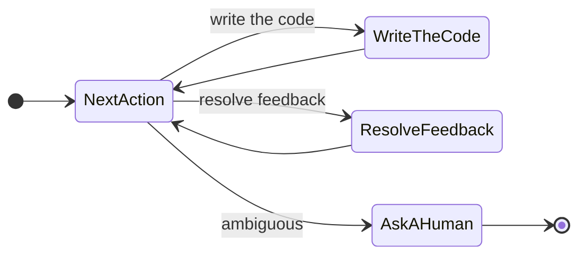
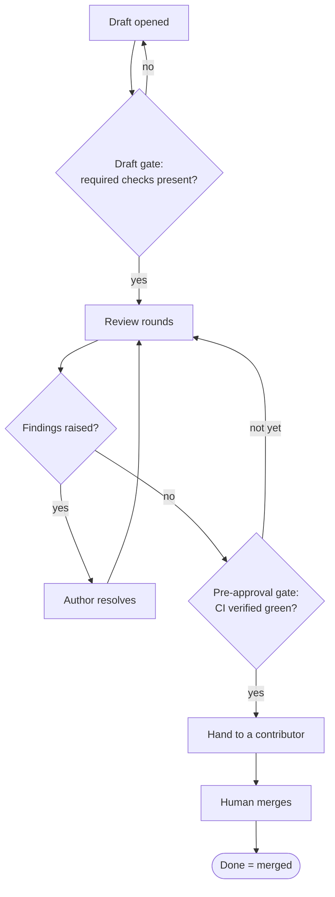
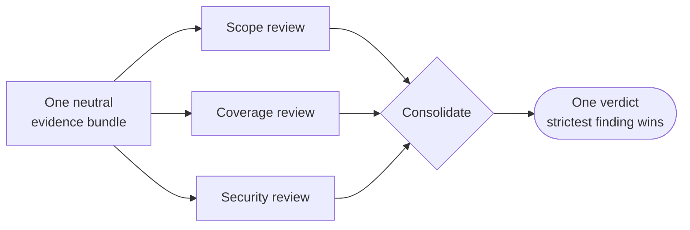
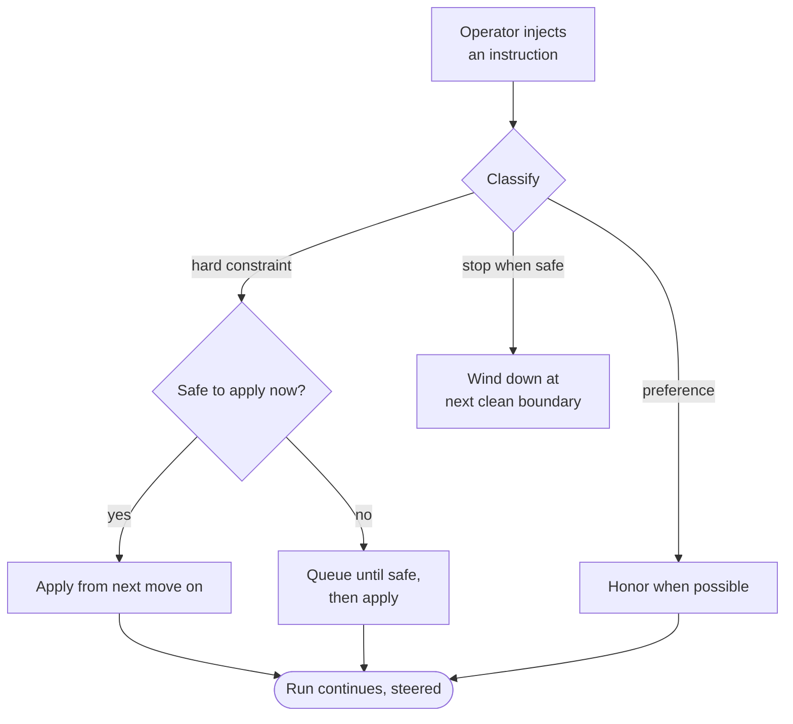
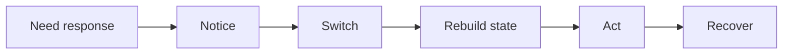
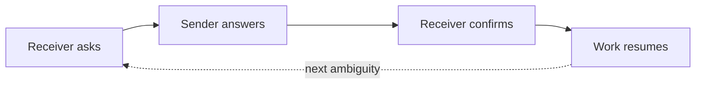
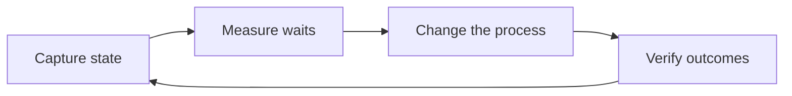
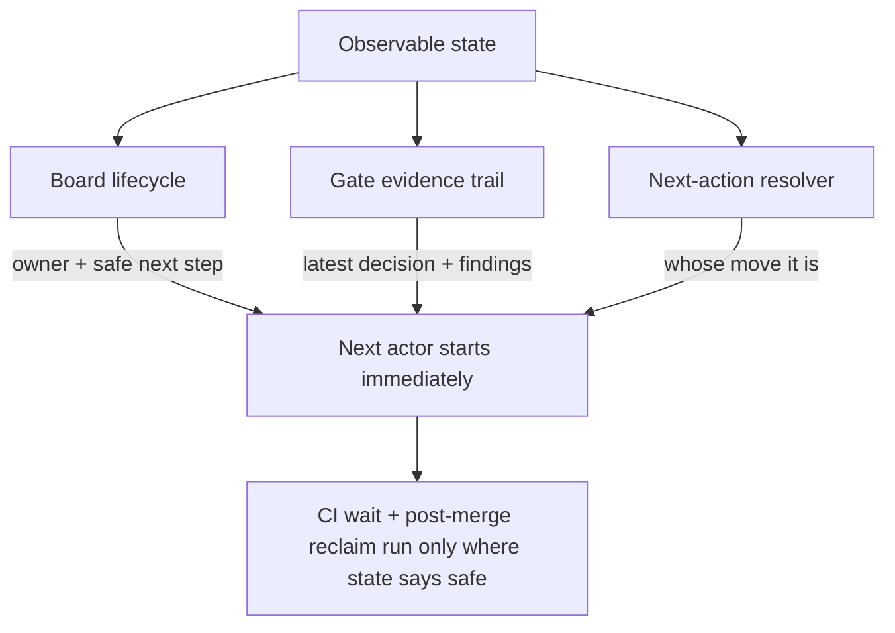

# dev-loops: A Deep Dive

> New here? Start with [Introducing dev-loops](./introducing-dev-loops.md) for the overview; this article is the deep dive beneath it.

An AI agent can write a working function in seconds. That part is solved. The hard part is everything that happens *around* the function: handing it to a reviewer, getting feedback back to the author, waiting for the build, deciding whether it is safe to merge. Each of those handoffs takes hours in real life, even when the diagram makes it look instant. An agent left to manage them on its own will guess at them. It assumes the build passed, assumes the review is done, and marks the work finished while those assumptions go unchecked.

That gap has a name: coordination delay. It is the time work spends waiting between people and steps, plus the rework caused when someone, or something, guesses wrong about where the work actually is. Code is cheap to write now, and the cost has moved into getting it through the pipeline.

This deep dive runs in two parts. The first part is about closing the gap: the next step is always known, so whoever is free pulls it from a state graph and the handoff turns optional. The second part is about the gap itself: the waiting between actions is where lead time goes now, and the reason it stays expensive is that nothing measures it.

# Part 1 — Eliminating coordination delay

## The one idea: the next step is always known

Here is the whole thing in a sentence: the next step is always known, like the next card on a Kanban board. The system computes the next action for any change at any time, and whoever is free pulls it from the visible state.

That sounds modest, yet it dissolves most of the lost hours in an AI-assisted workflow. Those hours live in the seams between steps, where someone usually has to package up context and hand it to the next actor, who then waits for that handoff to arrive. When the next action is already computed and on the board, the next actor reads it and pulls the work. The waiting-for-handoff disappears, because there is nothing left to wait to be handed.

The handoff turns optional, at most additive. When one happens it adds a note or extra context, and it stays a decision the system records where you can see it. It is no longer the load-bearing step the work blocks on. When the next action is ambiguous, the system stops and asks, and a human resolves it before the work moves on.

The work falls into loops nested inside loops. An outer loop asks, every cycle, *what is the next action here?*, then makes exactly one move before asking again. Inside it, one loop walks a single pull request from first draft to merged. Another tracks every review comment from raised to resolved, so nothing falls through. Every layer works the same way: read the next action, make one deliberate move, then ask again.

*Diagram 1 — The nested loops. An outer "what is the next action here?" decision routes each cycle to exactly one move, then returns to ask again. When the next step is ambiguous, the loop hands control to a human.*

## What a known next step buys you

Computing the next action for any change makes four behaviors possible that a guess-based workflow cannot offer.

The first is safe pauses. Because the system always knows where it is, it can stop without making a mess. Ask it to stop mid-edit and it finishes the current step, lands it clean, and hands you a stopping point with the file intact. There are only a few honest answers to "can I stop now?": stop this instant, stop at the next clean boundary, or not yet because a required check is missing. The system gives you whichever one holds.

The second is mid-flight steering. You can change the rules while the machine keeps running. Halfway through a run you can say "don't touch the auth module," and that lands as a hard constraint the remaining steps must honor; the run keeps its progress and applies the rule from the next move on. A softer nudge becomes a preference the system honors when it can, and a "stop when safe" request winds the work down at the next clean boundary.

The third is parallel review that consolidates into a single verdict. Several reviewers examine a pull request at once, each on a different angle (scope, test coverage, security), and all of them read the *same evidence bundle*: the same diff, the same context. Because the inputs are identical, the verdicts are directly comparable, and they merge into a single answer. One serious finding blocks the merge.

The fourth is the most important: "done" means merged. The board shows done only when a pull request has actually merged, read from the platform's own merge signal that the agent cannot fabricate. CI-green comes from the real check result, so the system waits for it before proceeding. And the merge itself always belongs to a contributor.

*Diagram 2 — A pull request's lifecycle through the gates. Every gate must run before the next step: a draft with missing checks loops back, an unresolved finding returns to the author, and a human performs the merge.*

## Fan out wide, fan in to one answer

The parallel review deserves a closer look, because it is a small pattern with a large payoff. Build the evidence once and neutrally (the diff plus just enough surrounding context) and hand that identical bundle to every reviewer. Every reviewer works from the same view, so their findings sit on the same footing. Then consolidate the separate verdicts into one, with the strictest finding winning.

*Diagram 3 — Fan-out / fan-in. One evidence bundle fans out to independent reviewers working different angles in parallel, then their findings fan back in to a single consolidated verdict.*

A shared bundle keeps the angles aligned, because when each reviewer scrapes its own context they end up arguing about different versions of reality. With one input feeding every angle in parallel, the verdicts stay comparable and merge into a single answer you can trust.

## Steering without stopping

Mid-flight steering is worth one more diagram, because it shows the discipline in action. When you inject an instruction, the system classifies it and decides *when* it can be honored safely.

*Diagram 4 — Steering flow. A hard constraint is applied immediately when it is safe, or queued until the next safe point. The run keeps its progress either way and applies the change only at a clean boundary.*

## Why a state graph beats a prompt

You could try to get all of this from prompting alone: write a long, careful instruction and trust the model to follow it. It will follow it most of the time, then drift without warning. Steer a workflow with prose and its behavior shifts with every model update, every longer context window, every change in sampling. That drift surfaces in production.

Run the workflow on a state graph. The set of possible moves is closed and listable, so the resolver can compute the one next action for any change and surface it. This is what makes the next step always known and pullable: the next actor reads the current state and takes the move waiting there, with no handoff to wait for. It buys two things prose alone cannot. A known set of moves is a testable set, so a wrong transition shows up in a test run before it reaches production. And the system can always say exactly where it is and what it is allowed to do next, which is what makes safe pauses, steering, and an honest "done" possible at all.

A state graph guarantees the behavior a prompt can only request. When the next step has to be knowable at any moment, the coordination layer itself should rest on something checkable.

# Part 2 — Make the waiting visible

Closing the handoffs is half the work. The other half is the gap itself. A change that used to take an afternoon now lands in seconds. The diff shows up before you've finished reading the request. Generation, the part we spent decades trying to speed up, is now fast enough to be routine.

Then the work sits. It sits while someone notices it's ready. It sits while a reviewer rebuilds enough context to have an opinion. It sits in a queue, waiting for the one person who knows whether the next step is safe. The code is written in seconds, and the change ships hours later. Almost none of that gap shows up anywhere you'd think to look.

The waiting between actions is where your lead time goes now, and it's the most expensive part of delivery precisely because nothing measures it. The fix starts with measurement, and there's a cheap, concrete way to begin.

## One interrupt costs five transitions

A "quick question" costs far more than the minute it takes to answer. The real cost is the chain it sets off: you notice the request, switch away from what you were doing, rebuild the mental state for the new thing, act on it, and then recover by climbing back into the work you abandoned and reconstructing where you were. Each link in that chain has its own latency, and most of that latency is pure overhead.

*Diagram 5 — The interrupt-cost chain. A five-minute question triggers five transitions, and the answer itself is only one of them.*

The five minutes of answering is the small box in the middle. The notice, switch, rebuild, and recover are the tax, and both sides of the exchange pay it. Across a queue of work, these costs multiply. Each handoff is an interrupt for whoever receives it, so a backlog of pending handoffs is a backlog of context switches waiting to happen.

## Every handoff restarts the same discovery from scratch

The same pattern repeats one level up, at the handoff.

When work crosses from one actor to another, the receiver starts an investigation: what changed since they last looked, whether they have enough context to act with confidence, who owns this now, and what's blocking it. When any of that is unclear, they ask, and you've paid for a round trip before any real work happens.

*Diagram 6 — One handoff round trip. Every question the state can't answer becomes an ask → answer → confirm cycle, and the work waits until it closes — then the next ambiguity restarts it.*

A mix of humans and AI agents makes it worse. Ambiguous ownership pauses a human until they ask. Missing context halts an agent, which either guesses and leaves you the cleanup or stops cold. Every human-to-agent and agent-to-human swap is one more place the state can drop on the floor. "More hands make it faster" holds only when the state survives each handoff intact, and any boundary it can fall through quietly cancels the gain you were counting on.

## The bottleneck is where human attention goes

The tools can show the wait. GitHub timestamps every transition; a pull request's timeline reveals exactly how long it sat between "CI passed" and "someone acted." The waiting is visible, when you choose to look.

The cost is not concealment — it is the routing. Getting work from "ready" to "shipped" runs through human attention, and attention has two failure modes. It is often not immediately available: the person who can act is in a meeting, context-switched onto something else, or on the other side of a timezone. That unavailability is where the stall lives. And when attention is available, spending it on mechanical coordination — noticing a status update, confirming a CI result, deciding a branch is safe to merge — crowds out the work only a person can do: shaping the product, setting the right review bar, staying accountable for what ships.

The drag on lead time is not that the tooling cannot see the wait. It is that routing routine transitions through human attention makes those transitions dependent on attention's availability — and pulls that attention away from the judgment-heavy decisions where it is genuinely irreplaceable.

## Four fields get the next actor moving

More meetings and status pings are themselves interrupts. The fix is making the state of the work explicit, so picking it up becomes a continuation of work already in motion.

Four fields carry most of that state:

- **Who owns it now**, so nobody guesses whose move it is.
- **What's blocking it**, and what would unblock it.
- **The latest decision**, so nobody re-litigates settled ground.
- **The safe next step**, the one move known to be safe to take.

Keep these four current and the next actor, human or agent, starts right away. The reconstruction is already written down, ready to read. The investigation that every handoff used to trigger collapses into a glance.

## Measure the wait first

Explicit state does more than speed up the next pickup. It turns the waiting into something you can measure, and measurement is what lets you shorten it.

Once you capture state at each transition, the waits between actors turn into numbers you can point at, in place of anecdotes like "review felt slow this sprint." From there you can run a real loop: find the transition that stalls the most, change the process at exactly that point, and check whether the wait dropped. Then confirm the change held quality steady, which is the step people skip once a wait finally drops.

*Diagram 7 — The measurement loop. Capture, measure, change, verify — then back to capture. It repeats as a cycle, because the slowest transition moves as you fix things.*

This is ordinary improvement discipline, applied to the part of delivery that has stayed invisible. Shortening a wait depends on measuring it, and measuring it depends on capturing its state.

## Those four fields already live in the work

"Make the state explicit" is more concrete than "write better tickets": each of the four fields maps onto a mechanism that already does the work when you let it.

**Owner and safe next step are a board.** Work moves through visible columns: waiting, in progress, done. The column carries the current owner and the safe next step, so a glance at it tells you both. A deterministic resolver picks the next action from the board's state, so "whose move is it?" has one settled answer.

**The latest decision leaves a trail.** Each review gate records its verdict in the open, with the findings that justified it attached. The decision lives written down, where it survives past the moment someone logs off. Pick the work up tomorrow and the reasoning is still there, right where the verdict was.

**Automation runs only where the state proves it's safe.** Handle the wait at CI by waiting on the real result, the actual check status from whatever provider runs it. After a merge, finished workspaces get reclaimed and long-done items get archived. Each of those automations is gated on state that says continuing is safe. The judgment stays human while the waiting in between gets handled automatically.

*Diagram 8 — Grounding "observable state" in real mechanisms. The board carries owner and next step, the gate trail carries the latest decision, the resolver answers whose move it is, and safe automation runs on that confirmed state.*

These are the same mechanisms from Part 1, read from the other side. The board, the gates, and the resolver carry the four fields latent in the work, ready to surface. Making them explicit stops them from leaking.

## The close

AI made the code cheap, and the coordination around it is now the expensive part. Most of that cost is paid in bad handoffs: wrong routing, stalls nobody noticed, and a "done" that was only assumed. The rest is paid in the waiting between actions, which stays expensive because nothing measures it.

So make the next step always known, and measure the waits. Compute the next action for any change and put it on the board, so whoever is free pulls it. Once the next action is visible, the rest follows from it: who acts next, whether it is safe to pause, what a mid-flight instruction means, and above all whether the work has actually merged. A handoff still happens when someone adds a note, and it stays a decision you can see. Build that on a state graph so the guarantee holds even when the model underneath you changes. Then capture state at each transition so the biggest stall shows up in plain numbers, and automate only where the state proves it's safe.

The next agent will write your code in seconds. The lever you control is the coordination around it: keep the next step known so the next actor pulls it, and measure how long the work waits.

<!--
---

## Rendering the diagrams on Medium

Before pasting into Medium, remove the YAML front-matter block (the `---` fenced `title` / `subtitle` / `tags` at the top) — Medium shows it as literal text; use the title and subtitle as the Medium headline and subtitle, and the tags as Medium tags.

Medium does not natively render Mermaid. Each diagram above is written as a fenced `mermaid` block so it stays editable, and each carries a caption so the article reads cleanly with each diagram shown as a static image. To publish on Medium, either paste each block into a Mermaid-enabled editor (for example, the Mermaid Live Editor or any Markdown tool with Mermaid support) and embed the rendered image, or export each diagram as SVG/PNG and drop it in where the block sits. Because every diagram is captioned, the prose carries the argument on its own and the diagrams support it.
-->
