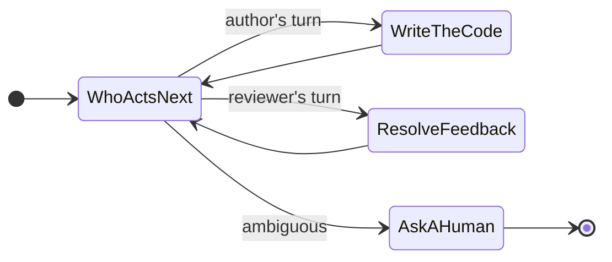
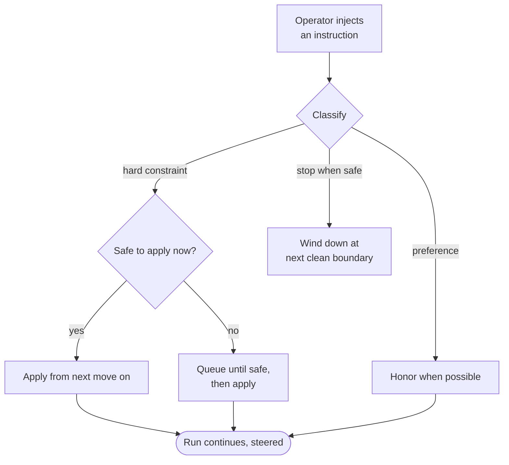

# Eliminating Coordination Delay in AI-Assisted Dev Workflows

An AI agent can write a working function in seconds. That part is solved. What is not solved is everything that happens *around* the function: handing it to a reviewer, getting feedback back to the author, waiting for the build, deciding whether it is safe to merge. Each of those handoffs looks instant on a diagram and takes hours in real life — and worse, when an agent is left to manage them on its own, it tends to *guess* at them. It assumes the build passed. It assumes the review is done. It marks the work finished because finishing felt close.

That gap has a name worth saying plainly: **coordination delay**. It is the time work spends waiting between people and steps, plus the rework caused when someone — or something — guesses wrong about where the work actually is. The code is cheap now. The coordination is not.

This article is about one idea for closing that gap, and why the shape of the solution matters as much as the idea itself.

## The one idea: never guess a handoff

Here is the whole thing in a sentence: **never guess a handoff — make every handoff an explicit, observable decision.**

That sounds modest. It is not. Most of the lost hours in an AI-assisted workflow are not lost inside the work; they are lost in the seams between steps, where the system has to answer a question like *who acts next?* or *is this actually ready?* and answers it with a hopeful assumption instead of a checked fact.

The fix is to refuse the assumption everywhere. Every transition — author to reviewer, reviewer back to author, ready-to-merge to merged — becomes a decision the system makes deliberately and writes down where you can see it. When the situation is ambiguous, the system does not pick the likeliest path and hope. It stops and asks. **Ambiguity never silently becomes a guess.**

Once you hold that rule, the work naturally organizes itself into loops nested inside loops. An outer loop asks, every cycle, *who acts next?* — and makes exactly one move before asking again. Inside it, one loop walks a single pull request from first draft to merged. Another tracks every review comment from raised to resolved, so nothing falls through. One move at a time, each move chosen on purpose.

*Diagram 1 — The nested loops. An outer "who acts next?" decision routes each cycle to exactly one move, then returns to ask again. When the next step is ambiguous, the loop hands control to a human rather than guessing.*

## What an explicit handoff buys you

Treating every handoff as a real decision is not bureaucracy. It is what makes four genuinely useful behaviors possible — behaviors a guess-based workflow simply cannot offer.

**Safe pauses.** Because the system always knows where it is, it can stop without making a mess. Ask it to stop mid-edit and it does not drop a half-written file; it finishes the current step, lands it clean, and hands you a tidy stopping point. There are only a few honest answers to "can I stop now?" — *stop this instant*, *stop at the next clean boundary*, or *I can't move at all because a required check is missing* — and the system gives you the true one.

**Mid-flight steering.** You can change the rules without stopping the machine. Halfway through a run you can say "don't touch the auth module," and that lands as a hard constraint the remaining steps must honor — no restart, no lost progress. The rule simply takes effect from the next move on. A softer nudge is treated as a preference it honors when it can; a "stop when safe" request winds the work down at the next clean boundary.

**Parallel review that produces one verdict.** A pull request can be examined from several angles at once — scope, test coverage, security — by reviewers that all read the *same evidence bundle*: the same diff, the same context. Because the inputs are identical, the verdicts are directly comparable, and they merge into a single answer. One serious finding is enough to block the merge. Many eyes, one decision.

**"Done" that means merged.** This is the one that matters most. In a guess-based system, "done" means the agent *believes* it is done. Here, the board shows done only when a pull request has actually merged — read from a real merge signal the agent cannot fabricate. The build being green is verified, not assumed; the system waits for the real result. And the agent never merges its own work — the final yes belongs to a named human, every time. **Done means merged — verified, never assumed.**

*Diagram 2 — A pull request's lifecycle through the gates. It cannot skip a gate that never ran: a draft with missing checks loops back, an unresolved finding returns to the author, and the merge belongs to a human, not the agent.*

## Fan out wide, fan in to one answer

The parallel review deserves a closer look, because it is a small pattern with a big payoff. The trick is to build the evidence *once* and neutrally — the diff plus just enough surrounding context — and hand that identical bundle to every reviewer. No reviewer gets a richer or poorer view than another, so their findings sit on the same footing. Then the separate verdicts are consolidated into one, with the strictest finding winning.

*Diagram 3 — Fan-out / fan-in. One evidence bundle fans out to independent reviewers working different angles in parallel, then their findings fan back in to a single consolidated verdict.*

This is the opposite of a free-for-all where each reviewer scrapes its own context and they end up arguing about different versions of reality. Same input, parallel angles, one output you can trust.

## Steering without stopping

Mid-flight steering is worth one more diagram, because it shows the discipline in action. When you inject an instruction, the system does not blindly obey on the spot — it classifies the instruction and decides *when* it can be honored safely.

*Diagram 4 — Steering flow. A hard constraint is applied immediately if it is safe, or queued until the next safe point if it is not — the run keeps its progress either way, and is never left half-changed.*

## Why a state graph beats a prompt

You could try to get all of this from prompting alone — write a long, careful instruction and trust the model to follow it. It will, mostly, until it doesn't. Steer a workflow with prose and its behavior shifts with every model update, every longer context window, every change in sampling. It drifts quietly, with no warning, and you find out in production.

The alternative is to run the workflow on a **state graph**: the set of possible moves is closed and listable, so every next step is known up front. That has two consequences that prose can never offer. First, a known set of moves is a *testable* set — a wrong transition is caught in a test run, not at 3 a.m. in production. Second, the system can always say exactly where it is and what it is allowed to do next, which is the very thing that makes safe pauses, steering, and an honest "done" possible in the first place.

A prompt is a wish about behavior. A state graph is a guarantee about it. When the whole point is to stop guessing, you do not want your coordination layer built on a guess.

## The close

Strip it all back and the message is simple. AI made the code cheap; the coordination around the code is now the expensive part, and most of that cost is paid in bad handoffs — wrong routing, silent stalls, and a "done" that turns out to be a hope.

So stop guessing handoffs. Make every one of them a decision you can see: who acts next, whether it is safe to pause, what a mid-flight instruction means, and — above all — whether the work is truly merged or merely assumed to be. Build that on a state graph so the guarantee holds even when the model underneath you changes.

Make every handoff a decision you can see, and nothing stalls in the dark.

---

## Rendering the diagrams on Medium

Medium does not natively render Mermaid. Each diagram above is written as a fenced `mermaid` block so it stays editable, and each carries a caption so the article reads cleanly even when a diagram is shown as a static image. To publish on Medium, either paste each block into a Mermaid-enabled editor (for example, the Mermaid Live Editor or any Markdown tool with Mermaid support) and embed the rendered image, or export each diagram as SVG/PNG and drop it in where the block sits. Because every diagram is captioned, the prose carries the argument on its own — the diagrams reinforce it rather than carry it.
