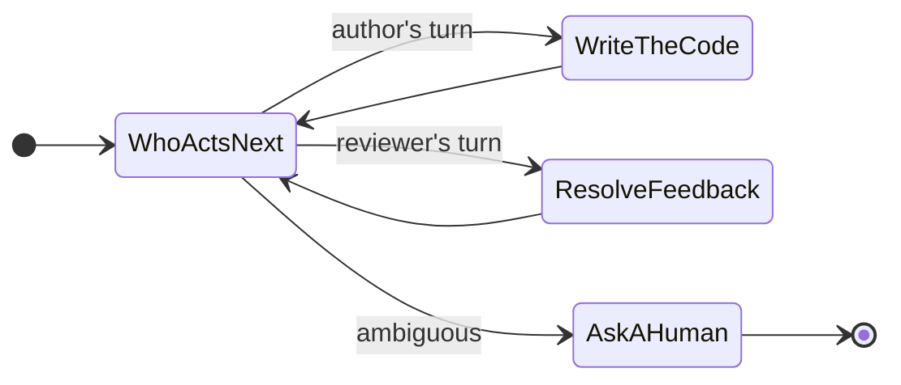
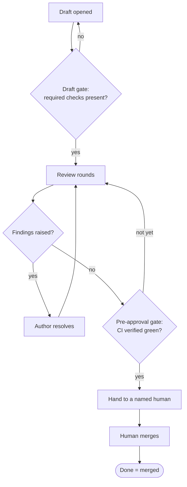
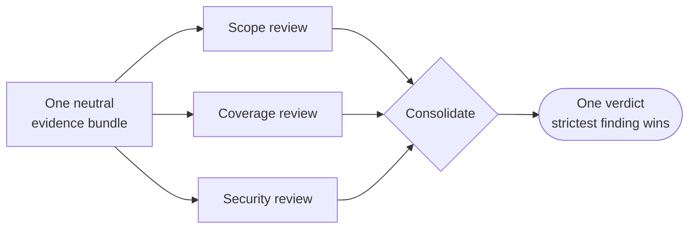

# Eliminating Coordination Delay in AI-Assisted Dev Workflows

> New here? Start with [Introducing dev-loops](./introducing-dev-loops.md) for the overview; this article is a deep dive beneath it.

An AI agent can write a working function in seconds. That part is solved. The hard part is everything that happens *around* the function: handing it to a reviewer, getting feedback back to the author, waiting for the build, deciding whether it is safe to merge. Each of those handoffs takes hours in real life, even when the diagram makes it look instant. An agent left to manage them on its own will guess at them. It assumes the build passed, assumes the review is done, and marks the work finished while those assumptions go unchecked.

That gap has a name: coordination delay. It is the time work spends waiting between people and steps, plus the rework caused when someone, or something, guesses wrong about where the work actually is. Code is cheap to write now, and the cost has moved into getting it through the pipeline.

This article is about one idea for closing that gap, and why the shape of the solution matters as much as the idea itself.

## The one idea: never guess a handoff

Here is the whole thing in a sentence: never guess a handoff. Make every handoff an explicit, observable decision.

That sounds modest, yet most of the lost hours in an AI-assisted workflow happen in the seams between steps, where the system has to answer a question like *who acts next?* or *is this ready?* and answers it with a hopeful assumption it never checks.

The fix is to refuse the assumption everywhere. Every transition (author to reviewer, reviewer back to author, ready-to-merge to merged) becomes a decision the system makes deliberately and writes down where you can see it. When the situation is ambiguous, the system stops and asks, and a human resolves it before the work moves on.

Hold that rule and the work falls into loops nested inside loops. An outer loop asks, every cycle, *who acts next?*, then makes exactly one move before asking again. Inside it, one loop walks a single pull request from first draft to merged. Another tracks every review comment from raised to resolved, so nothing falls through. Every layer works the same way: one deliberate move, then back to the question of who acts next.

*Diagram 1 — The nested loops. An outer "who acts next?" decision routes each cycle to exactly one move, then returns to ask again. When the next step is ambiguous, the loop hands control to a human.*

## What an explicit handoff buys you

Treating every handoff as a real decision makes four behaviors possible that a guess-based workflow cannot offer.

The first is safe pauses. Because the system always knows where it is, it can stop without making a mess. Ask it to stop mid-edit and it finishes the current step, lands it clean, and hands you a stopping point with the file intact. There are only a few honest answers to "can I stop now?": stop this instant, stop at the next clean boundary, or not yet because a required check is missing. The system gives you whichever one holds.

The second is mid-flight steering. You can change the rules while the machine keeps running. Halfway through a run you can say "don't touch the auth module," and that lands as a hard constraint the remaining steps must honor; the run keeps its progress and applies the rule from the next move on. A softer nudge becomes a preference the system honors when it can, and a "stop when safe" request winds the work down at the next clean boundary.

The third is parallel review that consolidates into a single verdict. Several reviewers examine a pull request at once, each on a different angle (scope, test coverage, security), and all of them read the *same evidence bundle*: the same diff, the same context. Because the inputs are identical, the verdicts are directly comparable, and they merge into a single answer. One serious finding blocks the merge.

The fourth is the most important: "done" means merged. The board shows done only when a pull request has actually merged, read from the platform's own merge signal that the agent cannot fabricate. CI-green comes from the real check result, so the system waits for it before proceeding. And the merge itself always belongs to a named human.

*Diagram 2 — A pull request's lifecycle through the gates. Every gate must run before the next step: a draft with missing checks loops back, an unresolved finding returns to the author, and a human performs the merge.*

## Fan out wide, fan in to one answer

The parallel review deserves a closer look, because it is a small pattern with a large payoff. Build the evidence once and neutrally (the diff plus just enough surrounding context) and hand that identical bundle to every reviewer. Every reviewer works from the same view, so their findings sit on the same footing. Then consolidate the separate verdicts into one, with the strictest finding winning.

*Diagram 3 — Fan-out / fan-in. One evidence bundle fans out to independent reviewers working different angles in parallel, then their findings fan back in to a single consolidated verdict.*

A shared bundle keeps the angles aligned, because when each reviewer scrapes its own context they end up arguing about different versions of reality. With one input feeding every angle in parallel, the verdicts stay comparable and merge into a single answer you can trust.

## Steering without stopping

Mid-flight steering is worth one more diagram, because it shows the discipline in action. When you inject an instruction, the system classifies it and decides *when* it can be honored safely.

*Diagram 4 — Steering flow. A hard constraint is applied immediately when it is safe, or queued until the next safe point. The run keeps its progress either way and applies the change only at a clean boundary.*

## Why a state graph beats a prompt

You could try to get all of this from prompting alone: write a long, careful instruction and trust the model to follow it. It will follow it most of the time, then drift without warning. Steer a workflow with prose and its behavior shifts with every model update, every longer context window, every change in sampling. That drift surfaces in production.

Run the workflow on a state graph instead. The set of possible moves is closed and listable, so every next step is known up front. That buys two things prose alone cannot. A known set of moves is a testable set, so a wrong transition shows up in a test run before it reaches production. And the system can always say exactly where it is and what it is allowed to do next, which is what makes safe pauses, steering, and an honest "done" possible at all.

A state graph guarantees the behavior a prompt can only request. When the whole point is to stop guessing, the coordination layer itself should rest on something checkable.

## The close

AI made the code cheap, and the coordination around it is now the expensive part. Most of that cost is paid in bad handoffs: wrong routing, stalls nobody noticed, and a "done" that was only assumed.

So stop guessing handoffs. Make every one of them a decision you can see: who acts next, whether it is safe to pause, what a mid-flight instruction means, and above all whether the work has actually merged. Build that on a state graph so the guarantee holds even when the model underneath you changes.

Make every handoff a decision you can see, and the work keeps moving in the open.

---

## Rendering the diagrams on Medium

Before pasting into Medium, remove the YAML front-matter block (the `---` fenced `title` / `subtitle` / `tags` at the top) — Medium shows it as literal text; use the title and subtitle as the Medium headline and subtitle, and the tags as Medium tags.

Medium does not natively render Mermaid. Each diagram above is written as a fenced `mermaid` block so it stays editable, and each carries a caption so the article reads cleanly with each diagram shown as a static image. To publish on Medium, either paste each block into a Mermaid-enabled editor (for example, the Mermaid Live Editor or any Markdown tool with Mermaid support) and embed the rendered image, or export each diagram as SVG/PNG and drop it in where the block sits. Because every diagram is captioned, the prose carries the argument on its own and the diagrams support it.
