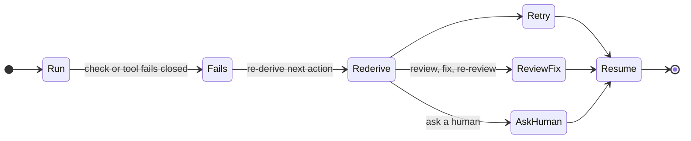
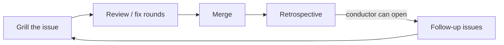

# Introducing dev-loops

In AI-assisted development, the slow part is now everything that has to happen around the code: someone notices a change is ready, rebuilds enough context to review it, checks that the tests ran, decides the next step is safe. Each of those is a small wait, and together those waits make up most of the lead time.

dev-loops is a runtime for those in-between steps. It keeps the state of every change explicit, computes the next action from that state, and runs the routine transitions itself — drafting, reviewing, gating on green CI — while recording each decision where you can read it. A person stays at the merge by default. This article explains the idea, shows what it does on a real repository, and walks through running it on your own project. A deeper piece is linked at the end.

## The idea

An agent left to its own devices tends to assume its way past the hard moments: it declares the review done, the tests good enough, the work finished, and nobody checks the declaration until something breaks. dev-loops replaces each of those assumptions with a decision the system takes deliberately. Is this change ready for review? Did the review actually run, with evidence? Is CI green on the current head? Every transition is computed, applied, and recorded — and when the answer is ambiguous, the loop fails closed and waits for a person.

Three ideas carry most of the value:

- **Every change walks the same path.** A draft gate checks the basics, automated review rounds look for real problems, and a pre-approval gate re-checks the final state — with green CI required at both gates unless a repository explicitly opts out. The changes that build dev-loops itself run this same path.
- **A person merges by default.** Out of the box the loop stops at the merge and hands over; it merges on its own only when a repository grants that explicitly. There is also a stricter setting that makes the merge human-only no matter what any single run claims — it cannot be overridden from inside the loop.
- **Work starts from a durable spec.** A change begins as a short plan file in the repository or as a tracked issue, and the pull request carries that spec through review to merge. There is always a written artifact to check the result against.

None of this is tied to one model or one editor, and the section [Model-agnostic by construction](#model-agnostic-by-construction) explains why that follows from the design. dev-loops is a runtime for the decisions around a change, and it runs inside the AI coding tools teams already use.

## What it does to the work

Coordination is the cost that compounds. Every change carries a handful of transitions — is it ready, who reviews it, did the review pass, is CI green, can it merge — and every transition a person runs by hand is an interrupt with a context-switch attached. Multiply transitions per change by the number of changes and the hand-run coordination grows much faster than the throughput it supports. That compounding is what caps how much an AI-assisted team ships.

The loop breaks the compounding by turning each transition into a machine decision with a log. What remains for the human is roughly one bounded decision per change: the merge, plus anything the loop flags as unclear.

dev-loops is developed with dev-loops, so the honest evidence is its own history. The numbers below come straight from the repository's git log, as of July 19, 2026:

<!-- metrics:start -->
- **570+** pull requests merged in the project's first ten weeks
- **~10/day** across the most recent two weeks
- **26** tagged releases in the same stretch, up to a 1.0 release candidate
- **1** human decision per change — the default posture stops at the merge
<!-- metrics:end -->

The review load behind that pace is real work, and it is where the loop earns its keep. At the draft gate, review fans out to focused reviewers that each read the change through a single lens — scope, coverage, correctness, and input validation among them. Before approval, a second fan-out applies design and simplicity lenses (DRY, KISS, YAGNI, single-responsibility) plus a check of the change against its own written acceptance criteria. Findings land as comments on the pull request, and a finding rated must-fix blocks a clean verdict until it is addressed. The gate sits exactly where unattended automation is usually weakest — the moment a change is about to land — so the cadence stays fast and every merge is one a person can stand behind.

## Model-agnostic by construction

The same loop runs three ways over one shared core: as a Claude Code plugin, as a Pi extension, and as a standalone CLI. Routing, gates, and phases are defined once; the harnesses are thin integrations over that shared workflow.

Model choice is configuration in the same spirit. Roles map to model tiers, and tiers map per harness to concrete models: routine subagents (implementation, docs, small fixes, build chores) default to the low tier, while planning and review — the steps that guard quality — run on the high tier, and the conductor inherits whatever the session runs. Swapping the model behind any role is a config edit.

That split is the practical argument for model flexibility. The structure constrains how far any single step can stray: each step is bounded, each gate fails closed, and the review fan-out checks the work regardless of which model produced it. So the quality bar sits where the gates put it, and a cheaper or self-hosted model can carry the routine steps while the strongest model you have is reserved for the judgment-heavy ones.

## It heals and improves itself

The loop already fails closed when a decision is ambiguous; the same posture covers failure. When a CI check fails or a tool response fails closed, the loop re-derives the next action from the state it already has, then retries the step, runs the review-fix rounds until the change converges, or stops and asks a human. The work resumes from the progress it already had.



*Diagram 1 — Self-healing. A failed check or a fail-closed tool response re-derives the next action, then retries, resolves through review, or asks a human — and resumes at the progress already made.*

<!-- figure
      <div class="flow" role="img" aria-label="Self-healing: a failed check or fail-closed tool triggers re-deriving the next action, which retries, runs review-fix-re-review, or asks a human, then resumes at preserved progress.">
        <div class="node start">Check&nbsp;or&nbsp;tool&nbsp;fails&nbsp;closed</div>
        <div class="edge"><span class="arrow">&rarr;</span></div>
        <div class="node accent">Re-derive&nbsp;next&nbsp;action</div>
        <div class="edge"><span class="arrow">&rarr;</span></div>
        <div class="flow-col">
          <div class="node">Retry</div>
          <div class="node">Review&nbsp;&rarr;&nbsp;fix&nbsp;&rarr;&nbsp;re-review</div>
          <div class="node">Ask&nbsp;a&nbsp;human</div>
        </div>
        <div class="edge"><span class="arrow">&rarr;</span></div>
        <div class="node">Resume&nbsp;at&nbsp;preserved&nbsp;progress</div>
      </div>
-->

The loop also sharpens its own inputs over time. Grilling turns a raw issue into a locked spec before any work starts, the review angles and the review/fix rounds tighten the change while it's in flight, and after merge a retrospective records advisory findings the conductor can open as new tracked issues that feed the next grill.



*Diagram 2 — Self-improving. Grilling locks the spec, review and fix rounds tighten the change, and a post-merge retrospective records advisory findings the conductor can open as new follow-up issues.*

<!-- figure
      <div class="flow" role="img" aria-label="Self-improving: grilling the issue leads to review and fix rounds, then merge, then a post-merge retrospective whose advisory findings the conductor can open as follow-up issues feeding back into grilling.">
        <div class="node start">Grill&nbsp;the&nbsp;issue</div>
        <div class="edge"><span class="arrow">&rarr;</span></div>
        <div class="node">Review&nbsp;/&nbsp;fix&nbsp;rounds</div>
        <div class="edge"><span class="arrow">&rarr;</span></div>
        <div class="node">Merge</div>
        <div class="edge"><span class="arrow">&rarr;</span></div>
        <div class="node accent">Retrospective&nbsp;(advisory)</div>
        <div class="edge"><span class="arrow">&rarr;</span><span class="edge-label">conductor&nbsp;can&nbsp;open&nbsp;follow-ups</span></div>
        <div class="node">Back&nbsp;to&nbsp;grilling</div>
      </div>
-->

## Set it up

dev-loops drives an ordinary GitHub pull-request workflow from inside Claude Code or Pi. You need Node 24 or newer and the GitHub CLI (`gh`) authenticated for your repository.

**Claude Code.** Install the plugin from the bundled marketplace catalog:

```text
/plugin marketplace add mfittko/dev-loops
/plugin install dev-loops@dev-loops
```

**Pi.** Install the extension from npm, pinned to a version so the surfaces cannot drift:

```bash
pi install npm:dev-loops@<version>
```

**Run a loop.** The named commands are direct entrypoints; the loop selects its internal strategy itself. On Claude Code:

```text
/loop-start 112          # start a dev loop on a tracked issue
/loop-auto 112           # run autonomously to the human-approval checkpoint
/loop-continue 112       # continue work on an issue or PR
/loop-continue           # bare: resume the single in-progress item (fails closed on 0 or several)
/loop-start-spike "why does checkout stall?"   # time-boxed exploration
/loop-info 112           # read-only state summary for an issue or PR
/loop-status             # readiness check: gh auth, git repo, subagents
```

On Pi the same set is reachable as subcommands of one command: `/dev-loops start 112`, `/dev-loops auto 112`, `/dev-loops continue`, and so on. Plain language works too — `start dev loop on issue 112` or `continue dev loop on PR 88` routes through the same deterministic router, so the named commands are thin shortcuts over it.

**Tune the posture (optional).** A `.devloops` file at the repository root controls how work arrives and how strict the loop is:

```yaml
# .devloops
version: 1
strategy: local-first    # start from a local plan file; tracker-first starts from a tracked issue
inputSource: tracker     # read the spec from the issue body, or phase-docs
refinement:
  maxCopilotRounds: 5     # automated review rounds before converging; 0 turns Copilot off
autonomy:
  humanMergeOnly: true    # merge stays a human-only action, regardless of any per-run flag
```

Three choices shape the experience. Work can start **local-first** — you write a short plan in the repository and the loop opens a pull request straight from it — or **tracker-first**, where a tracked issue is the starting point (`github-first` is a deprecated but still-accepted alias for the same setting). The automated review rounds can lean on Copilot or run without it. And the loop merges on its own only if you explicitly allow it; by default it stops and hands the merge to you. Start with the shipped defaults and dial each setting toward the autonomy your team is comfortable with. From 1.0 onward this configuration surface follows semantic versioning, so a `.devloops` file you write today keeps working across minor upgrades.

## Where to go deeper

The [dev-loops deep dive](./dev-loops-deep-dive.md) takes these ideas apart in detail, in two parts: why the next step is always computable from visible state, so the next actor can pull work the moment it is ready — and how to measure the waiting between actions, which accounts for most of the lead time.
