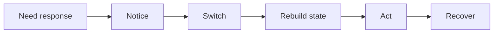
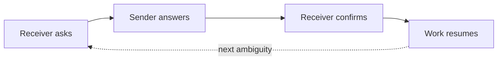
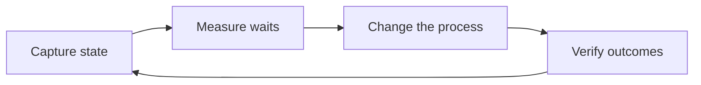
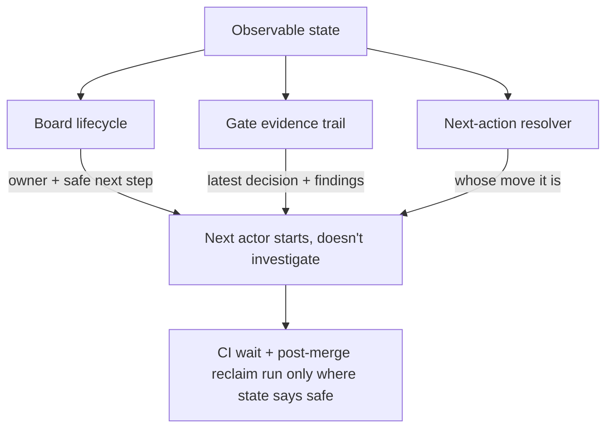

# Make the Waiting Visible

A change that used to take an afternoon now lands in seconds. The diff shows up before you've finished reading the request. Generation, the part we spent decades trying to speed up, stopped being the bottleneck.

Then the work sits. It sits while someone notices it's ready. It sits while a reviewer rebuilds enough context to have an opinion. It sits in a queue, waiting for the one person who knows whether the next step is safe. The code was written in seconds, but the change ships hours later, and almost none of that gap shows up anywhere you'd think to look.

The waiting between actions is where your lead time goes now. It's the most expensive part of delivery and the part nobody measures. So measure it. Here is a cheap, concrete way to start.

## One Interrupt Costs Five Transitions, Not Five Minutes

Everyone underestimates the interruption.

A "quick question" feels like it costs the minute it takes to answer, but the real cost is the chain it sets off. You notice the request, switch away from what you were doing, rebuild the mental state for the new thing, act on it, and then recover by climbing back into the work you abandoned and reconstructing where you were. Each link in that chain has its own latency, and most of them are overhead with nothing to show for it.

*Figure 1 — The interrupt-cost chain. A five-minute question triggers five transitions, and the answer itself is only one of them.*

The five minutes of answering is the small box in the middle. The notice, switch, rebuild, and recover are the tax, and both sides of the exchange pay it. Across a queue of work, these costs multiply rather than add. Each handoff is an interrupt for whoever receives it, so a backlog of pending handoffs is a backlog of context switches waiting to happen.

## Every Handoff Restarts the Same Discovery From Scratch

The same pattern repeats one level up, at the handoff.

When work crosses from one actor to another, the receiver rarely picks up where the sender left off. They start an investigation instead: what changed since they last looked, whether they have enough context to act with confidence, who owns this now, and what's blocking it. When any of that is unclear, they ask, and you've paid for a round trip before any real work happens.

*Figure 2 — One handoff round trip. Every question the state can't answer becomes an ask → answer → confirm cycle, and the work waits until it closes — then the next ambiguity restarts it.*

A mix of humans and AI agents makes it worse. Ambiguous ownership pauses a human until they ask. Missing context halts an agent, which either guesses and leaves you the cleanup, or stops cold. Every human-to-agent and agent-to-human swap is one more place the state can drop on the floor. "More hands make it faster" only holds when the state crosses the handoff intact; otherwise you've added more boundaries for it to fall through.

## Your Git History Hides Exactly Where the Time Went

This is the hard part: none of the tools you already trust can see the waiting.

Commits record output. They tell you a change happened, not that it sat idle for six hours before anyone touched it. Review threads bury the cost of re-reading and re-explaining inside ordinary back-and-forth, so the conversation reads like progress. CI timestamps end at green and say nothing about the gap between "checks passed" and "a human noticed and acted." Every instrument points at the work itself, and the waiting happens in between.

The biggest drag on lead time is the one thing none of your dashboards can see. You can optimize generation forever and the chart of "time from request to shipped" will barely move, because you were never optimizing the slow part.

## Four Fields Decide Whether the Next Actor Starts or Stalls

More meetings and status pings won't fix this; they are themselves interrupts. What fixes it is making the state of the work explicit, so picking it up becomes continuation instead of investigation.

Four fields carry most of that state:

- **Who owns it now**, so nobody guesses whose move it is.
- **What's blocking it**, and what would unblock it.
- **The latest decision**, so nobody re-litigates settled ground.
- **The safe next step**, the one move known to be safe to take.

Keep these four current and the next actor, human or agent, starts right away. There's nothing to reconstruct, because the reconstruction is already written down. The investigation that every handoff used to trigger collapses into a glance.

## You Can't Shorten a Wait You Never Measured

Explicit state does more than speed up the next pickup. It turns the waiting into something you can measure, and measurement is what lets you shorten it.

Once you capture state at each transition, the waits between actors stop being anecdotes ("review felt slow this sprint") and become numbers you can point at. From there you can run a real loop: find the transition that stalls the most, change the process at exactly that point, and check whether the wait dropped. Then confirm the change didn't trade speed for quality, the step people skip. Faster only counts if it's still correct.

*Figure 3 — The measurement loop. Capture, measure, change, verify — then back to capture. It's a cycle, not a one-time audit, because the slowest transition moves as you fix things.*

This is ordinary improvement discipline, applied to the part of delivery we'd been flying blind on. You can't shorten a wait you never measured, and you can't measure a wait whose state you never captured.

## Those Four Fields Already Live in the Work

You might suspect "make the state explicit" is just a nicer way of saying "write better tickets." It isn't, because each of the four fields maps onto a mechanism that already does the work when you let it.

**Owner and safe next step are a board.** Work moves through visible columns: waiting, in progress, done. The column is the current owner and the safe next step, so you read it rather than annotate it. A deterministic resolver picks the next action from the board's state, so "whose move is it?" has one answer instead of a debate.

**The latest decision leaves a trail.** Each review gate records its verdict in the open, with the findings that justified it attached. The decision lives written down rather than in someone's head, where it would be lost when they log off. Pick the work up tomorrow and the reasoning is still there, right where the verdict was.

**Automation runs only where the state proves it's safe.** Handle the wait at CI by waiting on the real result, the actual check status from whatever provider runs it, instead of guessing from a timer. After a merge, finished workspaces get reclaimed and long-done items get archived. Each of those automations is gated on state that says continuing is safe. The judgment stays human, and the waiting in between gets handled.

*Figure 4 — Grounding "observable state" in real mechanisms. The board carries owner and next step, the gate trail carries the latest decision, the resolver answers whose move it is — and only then does safe automation run.*

None of this is exotic. The four fields aren't aspirations to bolt on later; they already sit latent in the board, the gates, and the resolver. Making them explicit stops them from leaking.

## Stop Optimizing How Fast You Write Code

When an agent can write a feature in seconds, the tempting move is to chase generation speed with a faster model, a tighter prompt, one more agent. But generation was never the slow part, and shaving it gets you almost nothing.

The waiting is the slow part, and it's cheap to fix once you can see it. Make the state explicit and pickup becomes continuation instead of investigation. Measure the waits and the biggest stall stops hiding behind your commit history. Automate only where the state proves it's safe and you cut the stall without losing the human judgment.

The next agent will write your code in seconds either way. What you control is how long it waits afterward, so measure that.

---

### Rendering the diagrams on Medium

Medium doesn't natively render Mermaid. To publish these:

- Paste each `mermaid` block into a Mermaid live editor (or any tool that renders Mermaid), then export the result as **SVG or PNG** and upload it as an image where the block appears.
- Each diagram is captioned so it reads correctly as a static image, with the caption carrying the point even when the diagram appears without its source.
- Keep the figure captions (the *Figure N* lines) as image captions in Medium so the flow still reads top to bottom.
