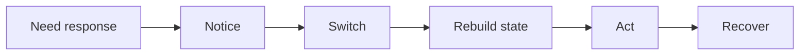
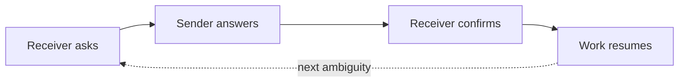
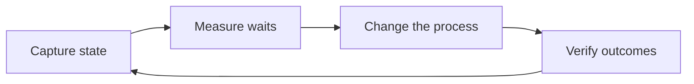
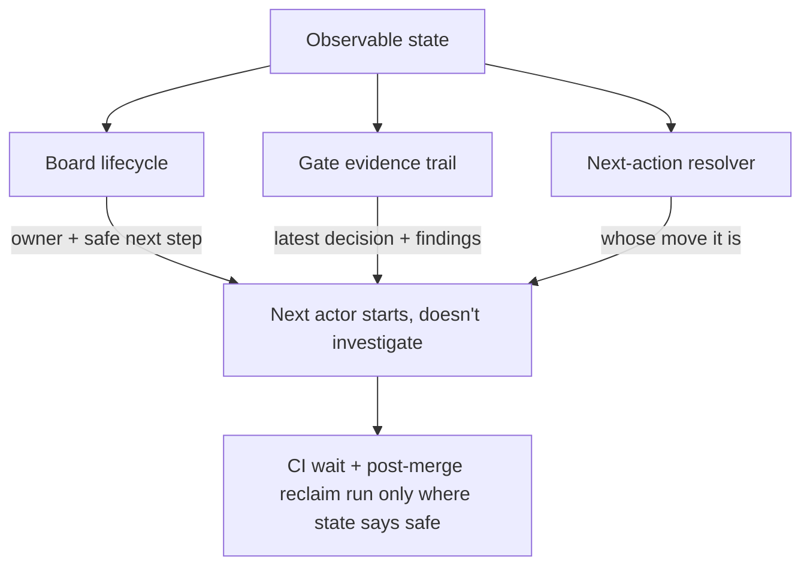

# Make the Waiting Visible

Watch an AI agent work and the first thing you notice is the speed. A change that used to take an afternoon lands in seconds. The diff is there before you've finished reading the request. Generation, the part we spent decades trying to accelerate, is no longer the bottleneck.

Then the work *sits*.

It sits while someone notices it's ready. It sits while a reviewer rebuilds enough context to have an opinion. It sits in a queue, waiting for the one person who knows whether the next step is safe. The code was written in seconds; the change ships hours later. And almost none of that gap shows up anywhere you'd think to look.

That gap — the waiting between actions — is where your real lead time goes now. It's the most expensive part of delivery and the least measured. This is an argument for measuring it, and for a cheap, concrete way to start.

## One Interrupt Costs Five Transitions, Not Five Minutes

Start with the unit of waiting everyone underestimates: the interruption.

A "quick question" feels like it costs the minute it takes to answer. It doesn't. The real cost is the chain it sets off. You have to *notice* the request, *switch* away from what you were doing, *rebuild* the mental state for the new thing, *act* on it, and then *recover* — climb back into the work you abandoned, reconstructing where you were. Each link in that chain has its own latency, and most of them are pure overhead with nothing to show for it.

*Figure 1 — The interrupt-cost chain. A five-minute question triggers five transitions, and the answer itself is only one of them.*

The five minutes of answering is the small box in the middle. The notice, the switch, the rebuild, and the recover are the tax, paid on *both* sides of the exchange. And across a queue of work, these don't add up — they multiply. Each handoff is an interrupt for whoever receives it, and a backlog of pending handoffs is a backlog of context switches waiting to happen.

## Every Handoff Restarts the Same Discovery From Scratch

Zoom out from a single interrupt to a single handoff, and the pattern repeats at a larger scale.

When work crosses from one actor to another, the receiver doesn't just pick up where the sender left off. They start an investigation. What changed since I last looked? Do I have enough context to act with confidence? Who owns this now, and what's blocking it? If any of that is unclear, they have to ask — and now you've paid for a round trip before any real work happens.

*Figure 2 — One handoff round trip. Every question the state can't answer becomes an ask → answer → confirm cycle, and the work waits until it closes — then the next ambiguity restarts it.*

It gets worse when the actors are a mix of humans and AI agents. Ambiguous ownership *pauses a human* until they ask. Missing context *halts an agent* — it either guesses (and you inherit the cleanup) or it stops cold. Every human-to-agent and agent-to-human swap is one more place the state can quietly drop on the floor. The promise of "more hands make it faster" only holds when the state crosses the handoff intact. Otherwise you've just added more boundaries for it to fall through.

## Your Git History Hides Exactly Where the Time Went

Here's the part that makes this so hard to fix: the waiting is invisible to every tool you already trust.

Commits record output. They tell you a change happened, not that it sat idle for six hours before anyone touched it. Review threads bury the cost of re-reading and re-explaining inside ordinary back-and-forth — the conversation looks like progress. CI timestamps end at green; they say nothing about the gap between "checks passed" and "a human noticed and acted." Every instrument you have is pointed at the work, and the waiting happens *between* the work, in the dark.

So the single biggest drag on lead time is the one thing none of your dashboards can see. You can optimize generation forever and the chart of "time from request to shipped" will barely move, because you were never optimizing the slow part.

## Four Fields Decide Whether the Next Actor Starts or Stalls

The fix is not more meetings or more status pings — those are *more* interrupts. The fix is to make the state of the work explicit, so picking it up becomes *continuation* instead of *investigation*.

Concretely, four fields do almost all of the work:

- **Who owns it now** — so there's no guessing whose move it is.
- **What's blocking it** — and what would unblock it.
- **The latest decision** — so nobody re-litigates settled ground.
- **The safe next step** — the one move that's known to be safe to take.

Keep these four current and the next actor, human or agent, starts immediately. There's nothing to reconstruct, because the reconstruction has already been written down. The investigation that every handoff used to trigger collapses into a glance.

## You Can't Shorten a Wait You Never Measured

Explicit state does more than speed up the next pickup. It turns the waiting into something you can measure — and measurement is what lets you actually shorten it.

Once state is captured at each transition, the waits between actors stop being anecdotes ("review felt slow this sprint") and become numbers you can point at. From there you can run a real loop: find the transition that stalls the most, change the process at exactly that point, and check whether the wait actually dropped. Then — and this is the step people skip — confirm the change didn't trade speed for quality. Faster only counts if it's still correct.

*Figure 3 — The measurement loop. Capture, measure, change, verify — then back to capture. It's a cycle, not a one-time audit, because the slowest transition moves as you fix things.*

This is the ordinary discipline of improvement applied to the part of delivery we'd been flying blind on. You can't shorten a wait you never measured, and you can't measure a wait whose state was never captured.

## Those Four Fields Aren't a Wish — They're Where the Work Already Lives

It's fair to ask whether "make the state explicit" is just a nicer way of saying "write better tickets." It isn't, because each of those four fields maps onto a mechanism that already does the work, if you let it.

**Owner and safe next step are a board.** Work moves through visible columns — waiting, in progress, done. The column *is* the current owner and the safe next step; you don't annotate it, you read it. A deterministic resolver can then pick the next action from the board's state, so "whose move is it?" has one answer instead of a debate.

**The latest decision leaves a trail.** Each review gate records its verdict in the open, with the findings that justified it attached. The decision is written down, not held in someone's head and lost when they log off. Pick the work up tomorrow and the reasoning is still there, exactly where the verdict was.

**Automation runs only where the state proves it's safe.** The wait at CI is handled by waiting on the real result — the actual check status, from whatever provider runs it — not by guessing from a timer. After a merge, finished workspaces are reclaimed and long-done items are archived. Each of those automations is gated on state that says continuing is safe; the judgment stays human, but the waiting in between gets handled.

*Figure 4 — Grounding "observable state" in real mechanisms. The board carries owner and next step, the gate trail carries the latest decision, the resolver answers whose move it is — and only then does safe automation run.*

None of this is exotic. It's the recognition that the four fields aren't aspirations to bolt on later; they're already latent in the board, the gates, and the resolver. Making them explicit just stops them from leaking.

## Stop Optimizing How Fast You Write Code

The temptation, in a world where an agent can write a feature in seconds, is to chase generation speed — a faster model, a tighter prompt, one more agent. But generation was never the slow part, and shaving it gets you almost nothing.

The slow part is the waiting, and the waiting is cheap to fix once you can see it. Make the state explicit and pickup becomes continuation instead of investigation. Measure the waits and the biggest stall stops hiding behind your commit history. Automate only where the state proves it's safe and you remove the stall without removing the judgment.

So stop optimizing how fast you write code. Start measuring how long it waits.

---

### Rendering the diagrams on Medium

Medium doesn't natively render Mermaid. To publish these:

- Paste each `mermaid` block into a Mermaid live editor (or any tool that renders Mermaid), then export the result as **SVG or PNG** and upload it as an image where the block appears.
- Each diagram is captioned so it reads correctly as a static image — the caption carries the point even if the diagram is shown without its source.
- Keep the figure captions (the *Figure N* lines) as image captions in Medium so the flow still reads top to bottom.
