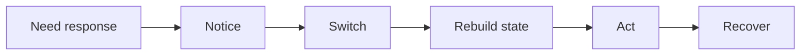
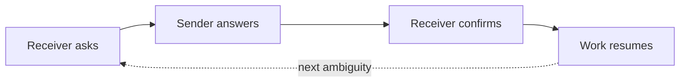
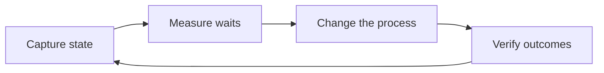
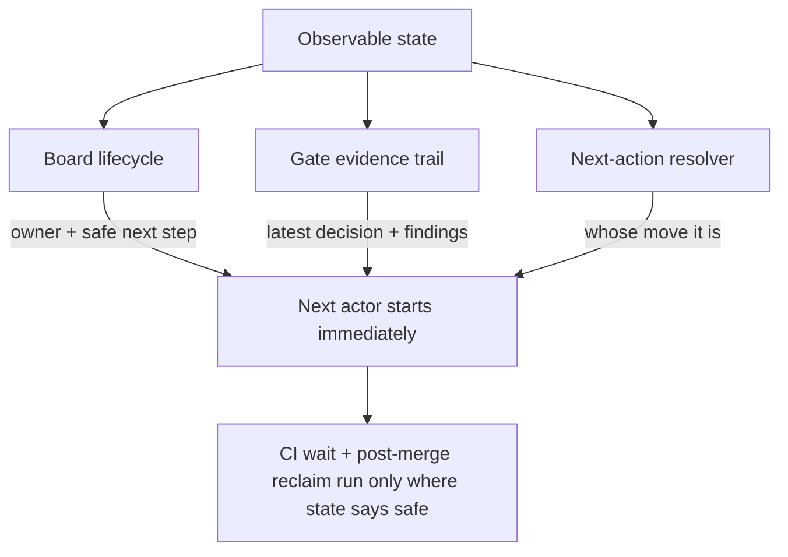

# Make the Waiting Visible

A change that used to take an afternoon now lands in seconds. The diff shows up before you've finished reading the request. Generation, the part we spent decades trying to speed up, is now fast enough to drop off the timeline.

Then the work sits. It sits while someone notices it's ready. It sits while a reviewer rebuilds enough context to have an opinion. It sits in a queue, waiting for the one person who knows whether the next step is safe. The code is written in seconds, and the change ships hours later. Almost none of that gap shows up anywhere you'd think to look.

The waiting between actions is where your lead time goes now, and it's the most expensive part of delivery precisely because nothing measures it. The fix starts with measurement, and there's a cheap, concrete way to begin.

## One Interrupt Costs Five Transitions

Everyone underestimates the interruption.

A "quick question" costs far more than the minute it takes to answer. The real cost is the chain it sets off: you notice the request, switch away from what you were doing, rebuild the mental state for the new thing, act on it, and then recover by climbing back into the work you abandoned and reconstructing where you were. Each link in that chain has its own latency, and most of that latency is pure overhead.

*Figure 1 — The interrupt-cost chain. A five-minute question triggers five transitions, and the answer itself is only one of them.*

The five minutes of answering is the small box in the middle. The notice, switch, rebuild, and recover are the tax, and both sides of the exchange pay it. Across a queue of work, these costs multiply. Each handoff is an interrupt for whoever receives it, so a backlog of pending handoffs is a backlog of context switches waiting to happen.

## Every Handoff Restarts the Same Discovery From Scratch

The same pattern repeats one level up, at the handoff.

When work crosses from one actor to another, the receiver starts an investigation: what changed since they last looked, whether they have enough context to act with confidence, who owns this now, and what's blocking it. When any of that is unclear, they ask, and you've paid for a round trip before any real work happens.

*Figure 2 — One handoff round trip. Every question the state can't answer becomes an ask → answer → confirm cycle, and the work waits until it closes — then the next ambiguity restarts it.*

A mix of humans and AI agents makes it worse. Ambiguous ownership pauses a human until they ask. Missing context halts an agent, which either guesses and leaves you the cleanup or stops cold. Every human-to-agent and agent-to-human swap is one more place the state can drop on the floor. "More hands make it faster" holds only when the state survives each handoff intact, and any boundary it can fall through quietly cancels the gain you were counting on.

## Your Git History Hides Exactly Where the Time Went

This is the hard part: none of the tools you already trust can see the waiting.

Commits record output. They mark that a change happened and stay silent on the six hours it sat idle before anyone touched it. Review threads bury the cost of re-reading and re-explaining inside ordinary back-and-forth, so the conversation reads like progress. CI timestamps end at green, leaving the gap between "checks passed" and "a human noticed and acted" unrecorded. Every instrument points at the work itself, while the waiting accumulates in the gaps.

The biggest drag on lead time is the one thing none of your dashboards can see. You can optimize generation forever and the chart of "time from request to shipped" will barely move, because the slow part lies elsewhere.

## Four Fields Get the Next Actor Moving

More meetings and status pings are themselves interrupts. The fix is making the state of the work explicit, so picking it up becomes a continuation of work already in motion.

Four fields carry most of that state:

- **Who owns it now**, so nobody guesses whose move it is.
- **What's blocking it**, and what would unblock it.
- **The latest decision**, so nobody re-litigates settled ground.
- **The safe next step**, the one move known to be safe to take.

Keep these four current and the next actor, human or agent, starts right away. The reconstruction is already written down, ready to read. The investigation that every handoff used to trigger collapses into a glance.

## Measure the Wait First

Explicit state does more than speed up the next pickup. It turns the waiting into something you can measure, and measurement is what lets you shorten it.

Once you capture state at each transition, the waits between actors turn into numbers you can point at, in place of anecdotes like "review felt slow this sprint." From there you can run a real loop: find the transition that stalls the most, change the process at exactly that point, and check whether the wait dropped. Then confirm the change held quality steady, which is the step people skip once a wait finally drops.

*Figure 3 — The measurement loop. Capture, measure, change, verify — then back to capture. It repeats as a cycle, because the slowest transition moves as you fix things.*

This is ordinary improvement discipline, applied to the part of delivery that has stayed invisible. Shortening a wait depends on measuring it, and measuring it depends on capturing its state.

## Those Four Fields Already Live in the Work

"Make the state explicit" is more concrete than "write better tickets": each of the four fields maps onto a mechanism that already does the work when you let it.

**Owner and safe next step are a board.** Work moves through visible columns: waiting, in progress, done. The column carries the current owner and the safe next step, so a glance at it tells you both. A deterministic resolver picks the next action from the board's state, so "whose move is it?" has one settled answer.

**The latest decision leaves a trail.** Each review gate records its verdict in the open, with the findings that justified it attached. The decision lives written down, where it survives past the moment someone logs off. Pick the work up tomorrow and the reasoning is still there, right where the verdict was.

**Automation runs only where the state proves it's safe.** Handle the wait at CI by waiting on the real result, the actual check status from whatever provider runs it. After a merge, finished workspaces get reclaimed and long-done items get archived. Each of those automations is gated on state that says continuing is safe. The judgment stays human while the waiting in between gets handled automatically.

*Figure 4 — Grounding "observable state" in real mechanisms. The board carries owner and next step, the gate trail carries the latest decision, the resolver answers whose move it is, and safe automation runs on that confirmed state.*

None of this is exotic. The four fields already sit latent in the board, the gates, and the resolver, ready to surface. Making them explicit stops them from leaking.

## The Waiting Is the Part Worth Fixing

When an agent can write a feature in seconds, the tempting move is to chase generation speed with a faster model, a tighter prompt, one more agent. Generation already runs fast enough that shaving it gets you almost nothing.

The waiting is the slow part, and it turns out to be cheap to fix once you can see it. Make the state explicit and pickup becomes a clean continuation of work already under way; measure the waits and the biggest stall shows up in plain numbers; automate only where the state proves it's safe, and the stall shrinks while human judgment stays exactly where it belongs.

The next agent will write your code in seconds. The lever you control is how long it waits afterward, so measure that.

---

### Rendering the diagrams on Medium

Medium doesn't natively render Mermaid. To publish these:

- Remove the YAML front-matter block (the `---` fenced `title` / `dek` / `tags` at the top) before pasting — Medium shows it as literal text. Use the title and dek as the Medium headline and subtitle, and the tags as Medium tags.
- Paste each `mermaid` block into a Mermaid live editor (or any tool that renders Mermaid), then export the result as **SVG or PNG** and upload it as an image where the block appears.
- Each diagram is captioned so it reads correctly as a static image, with the caption carrying the point even when the diagram appears without its source.
- Keep the figure captions (the *Figure N* lines) as image captions in Medium so the flow still reads top to bottom.
