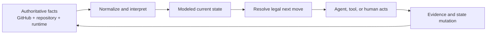
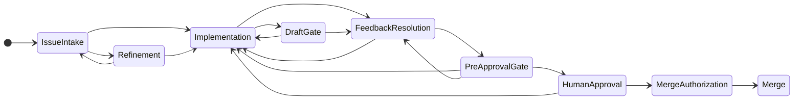
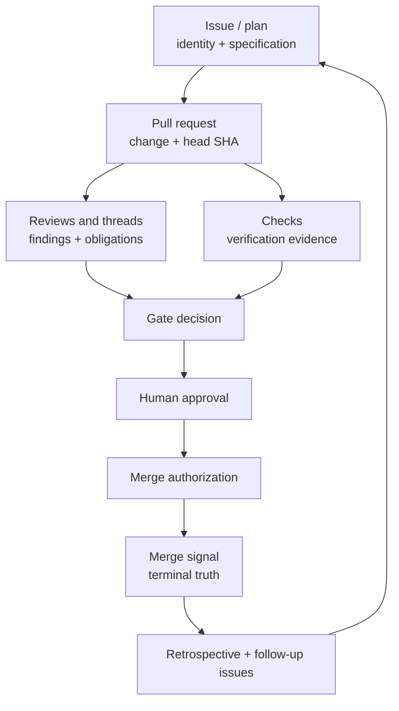
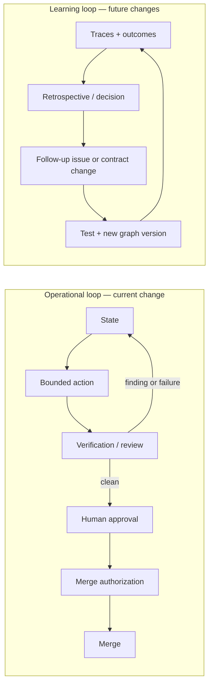

# The State Graph Is the Surface

> Start with [Introducing dev-loops](./introducing-dev-loops.md) for the product overview, [the deep dive](./dev-loops-deep-dive.md) for the operational mechanics, and [How dev-loops Decided Itself Into Shape](./how-dev-loops-decided-itself.md) for the decision history. This article places the same system in the wider loop- and graph-engineering landscape.

> **Publication note:** this long-form Markdown source is intentionally not part of the repository's strict article-rendering list. Its tables and Mermaid source are maintained for repository reading; extending the renderer is outside this article's scope.

The vocabulary of agentic software development has moved quickly: prompt engineering, harness engineering, Ralph loops, Karpathy loops, graph engineering. These terms describe complementary layers of one system.

[The Ralph loop](https://ghuntley.com/ralph/) makes persistence external: run a bounded agent step, preserve durable artifacts, and start another iteration. [Karpathy's AutoResearch](https://github.com/karpathy/autoresearch) adds selection pressure: modify, evaluate against a fixed metric, keep the improvement or discard it, and repeat. Recent [graph-engineering](https://www.langchain.com/blog/3-years-of-graph-engineering-with-langgraph) discussions make the workflow topology explicit: deterministic paths where policy is known, agentic work where judgment is useful, and cycles where revision is expected.

`dev-loops` spans all three. Its center of gravity is more specific:

> **dev-loops is a graph/loop control surface built around a modeled state graph.**

The graph models the state of the work and the legal moves from that state. The loop repeatedly observes the authoritative world, resolves the current state, selects one legal move, executes it, records the result, and refreshes. The public surface exposes that model as start, continue, inspect, steer, wait, approve, and merge behavior. GitHub supplies the current reference backend for tracked work, review evidence, CI, and terminal merge truth.

The state model and its encoded policy form the durable product across changes to models, prompts, and chat transcripts.

## Where dev-loops fits

A useful way to position the repository is by the problem each pattern solves.

| Pattern | What it contributes | How dev-loops uses or extends it |
|---|---|---|
| Ralph loop | Persistence across repeated bounded agent runs | Re-entry is driven by freshly resolved state |
| Karpathy loop | Measured keep/discard selection | Review/fix convergence and retrospective follow-ups already create improvement loops; the modeled and testable control surface supplies inputs for a future keep/revert meta-loop over workflow changes |
| Graph engineering | Explicit paths, branches, cycles, and deterministic control | The graph models the work first, then projects the next actor and action |
| Evidence backend | Durable identity, evidence, coordination, and terminal facts | GitHub issues, pull requests, reviews, threads, checks, head SHAs, and merge state form the current authoritative evidence plane |

`dev-loops` currently self-corrects in flight and improves through review, retrospectives, follow-up issues, decision records, and tests. A general AutoResearch-style optimizer would add an outer loop that proposes graph or harness changes, evaluates them on a held-out task suite, and keeps or reverts them. Its explicit, versioned states, transitions, routing decisions, and traces provide the inputs for that layer.

## The graph follows the work

`dev-loops` models work facts such as:

- which artifact is active;
- whether an issue has a linked pull request;
- whether the pull request is draft or ready;
- whether review threads are unresolved;
- whether CI is pending, failed, or green;
- whether gate evidence is visible and pinned to the current head;
- who owns the work and who must act next;
- whether the next mutation is authorized;
- whether the change is merged.

Pure interpreters map those facts to one current state, the allowed transitions, and a recommended next action. Routing then chooses the appropriate loop family, tool, agent role, wait behavior, or human handoff.

The current state determines which actor can make the next move.



*Diagram 1 — The state-backed control loop. Execution is always followed by a refresh from authoritative facts.*

This is why the public `dev-loop` façade matters. A user expresses intent once. The surface resolves the target and current state, then routes to an internal strategy. The same state can be executed by a Claude Code plugin, a Pi extension, the CLI, a specialized agent, or a person under one workflow contract.

## The surface is a projection of modeled state

A control surface is the visible projection of what the model knows and permits.

The public state contract already exposes five dimensions:

| Dimension | Question it answers |
|---|---|
| `target` | What artifact is this run actually about? |
| `ownership` | Which durable owner or strategy family is responsible? |
| `nextActor` | Who is expected to make the immediate next move? |
| `status` | What lifecycle condition is active, including waits, blocks, approvals, merge readiness, and retrospective work? |
| `authorization` | Is the next mutation `authorized`, `needs_confirmation`, or `not_authorized`? |

From those dimensions the system can project:

- the route kind;
- the selected internal strategy;
- the next action;
- the relevant gate;
- wait semantics and timeout policy;
- the stop or reconcile reason;
- the handoff envelope for the next worker;
- the evidence required to resume later.

This is the central reframe:

> **The user-facing graph/loop surface is generated from modeled state.**

Status, continuation, automation, steering, safe pauses, and human approval all become different views or transitions over the same underlying model.

## Nested graphs, one authoritative progression

The repository models the work at several resolutions.

### 1. The public graph

The public router resolves the active artifact, ownership, immediate actor, status, authorization, route kind, and execution mode. It answers the operator-level question: *what does `dev-loop` mean right now?*

### 2. The lifecycle graph

The outer lifecycle models the change from intake to merge:



*Diagram 2 — The delivery progression is cyclic. Failed gates and new evidence route the change back into implementation or feedback resolution; clean evidence still stops for human approval and explicit merge authorization.*

### 3. Family-local inner graphs

The Copilot and reviewer machines model finer states such as waiting for review, unresolved feedback, reply-and-resolve work, waiting for CI, review invalidation, convergence, and blocked conditions. UI review and other specialized loops add their own bounded subgraphs.

The conductor consumes the interpreted state of each machine and decides which family owns the next step. Each layer has a narrow authority boundary.

That is graph composition: multiple state machines connected through explicit contracts.

## A loop is repeated state resolution

In `dev-loops`, a loop follows a strict state-resolution pattern.

```text
until terminal or human stop:
    snapshot = observe_authoritative_facts()
    state = interpret(snapshot)
    route = resolve_next_legal_move(state)
    result = execute_one_bounded_action(route)
    record(result)
    refresh()
```

The refresh is the important step. It prevents the executor from assuming that the world still matches the context it started with. A review may have arrived. CI may have failed. The head SHA may have changed. A human may have merged or closed the pull request. A steering instruction may have changed the allowed scope.

Each cycle therefore does three things:

1. **rebuild truth from the backend;**
2. **make one bounded move under the current policy;**
3. **return control to the state resolver.**

This is Ralph-like persistence with a stronger state discipline. The conversation can disappear because the next session can reconstruct the run from the same facts and contracts.

## GitHub is the reference evidence backend

In the current implementation, GitHub plays several backend roles at once.

### Tracker

Issues identify work, carry the initial specification, record assignment, and link to the implementing pull request. Queue and sub-issue structures can model larger work trees.

### Review system

Pull-request reviews, pending reviews, comments, threads, replies, and resolution state make feedback observable. Comments can be interpreted as unresolved obligations, resolved findings, gate verdicts, or handoffs.

### Verification ledger

Checks provide external evidence for CI state. Gate evidence is pinned to the current head SHA, so every revision needs current evidence.

### Terminal truth

A merged pull request is a platform fact. That makes “done means merged” enforceable.

### Recovery substrate

A fresh run can inspect the issue, pull request, reviews, checks, current head, and durable comments to reconstruct what happened.



*Diagram 3 — GitHub backs the built-in tracker, the PR review and evidence plane, and terminal merge truth.*

The repository contains a `Tracker` provider seam for issues and the board/queue, with GitHub as the built-in default. Pull requests, review threads, CI, and Copilot remain GitHub-coupled in v1. A future tracker provider can plug into the stable issue-and-board interface; a non-GitHub PR host would require a separate seam.

## Deterministic policy around probabilistic workers

The system assigns exact policy to deterministic code and contextual judgment to agents.

| Deterministic state and policy | Agentic work | Human authority |
|---|---|---|
| Normalize snapshots | Refine an ambiguous request | Resolve genuine ambiguity |
| Interpret current state | Explore a repository | Approve policy exceptions |
| List legal transitions | Implement the accepted scope | Accept high-risk trade-offs |
| Enforce gate ordering | Review through a focused angle | Authorize merge by default |
| Verify head-pinned evidence | Fix the narrowest valid issue | Remain accountable for what ships |
| Fail closed to wait, stop, or reconcile | Summarize findings and propose follow-ups | Change the governing rules |

The resulting state machine places model judgment inside bounded transitions.

## The same control model works in greenfield and brownfield repositories

The state graph models the lifecycle of a **change**. Repository age changes the facts and verification burden supplied to that graph.

| Greenfield context | Brownfield context |
|---|---|
| Specification may begin as a local plan or new tracker item | Specification must include existing behavior, compatibility, and migration constraints |
| Architecture can be established during refinement | Existing architecture and ADRs constrain the valid implementation space |
| Tests are created with the feature | Existing tests, production behavior, and historical regressions become evidence |
| Scope often has fewer hidden dependencies | Context compilation and repository search are more important |
| Rollback may be simple | Rollout, data safety, and public-contract preservation may need stronger gates |

The context and evidence bundle vary while the control model remains stable:

- resolve authoritative state;
- select one legal move;
- isolate the work;
- verify against the applicable contracts;
- loop through feedback until convergence;
- stop at ambiguity or authorization boundaries;
- record terminal truth in the backend.

A brownfield repository requires richer facts, stronger invariants, and more demanding gates. The same graph/loop surface can carry both contexts. Portability beyond this bootstrap repository is not yet established: the planned second-repository pilot has not started, and repeated external runs remain required future evidence.

## Self-correction today, self-improvement as the next layer

Two kinds of loop should remain distinct.

### Operational self-correction

The current system already handles in-flight correction:

- a failed or missing check becomes a visible state;
- unresolved review feedback routes back to fix/reply/resolve;
- a changed head invalidates stale evidence;
- the resolver re-derives the next action;
- bounded rounds prevent infinite review churn;
- ambiguous or contradictory state fails closed;
- a fresh session can resume from preserved evidence.

This loop improves the current change until it satisfies the gates.

### Workflow learning

The repository also improves its future behavior:

- grilling hardens a request before implementation;
- focused review angles expose recurring failure classes;
- retrospectives record advisory findings;
- the conductor can turn warranted findings into follow-up issues;
- architecture decisions preserve why a rule exists and when it was reversed;
- tests convert hard-won conventions into machine-enforced contracts.

This loop improves the process across changes.



*Diagram 4 — The operational loop converges one change; the learning loop changes the system that will handle later changes.*

### A Karpathy-style meta-loop

The next logical extension is an evaluated outer loop over the control surface itself:

```text
propose a routing / prompt / model / gate / context change
    ↓
run old and candidate graph versions on held-out historical tasks
    ↓
measure correctness, review burden, cost, latency, and policy violations
    ↓
keep the candidate only when it improves within safety constraints
    ↓
otherwise revert
```

The evaluator must remain outside the candidate's control. A private replay suite built from real repository tasks, escaped defects, review findings, and human correction effort provides an oracle that resists gaming.

The versioned set of state models, transition tables, configuration, role mappings, gates, and handoff contracts gives an evaluated meta-loop a testable optimization target.

## What the graph/loop surface buys

Once the state graph is treated as the primary product, several existing capabilities line up as consequences of the same design.

### Harness independence

Claude Code, Pi, and the CLI are adapters over shared routing and state logic. Models and harnesses can change while the workflow stays stable.

### Safe resumption

A run can stop and later reconstruct state from authoritative facts.

### Explainability

The system can report where the work is, why it routed there, what evidence it used, what it is allowed to do next, and why it stopped.

### Steering

A constraint or stop request can be applied at the next safe boundary because the surface knows which boundaries exist.

### Testability

A closed set of states and transitions can be unit-tested. Routing regressions become visible code failures.

### Replaceable workers

An agent, deterministic tool, or human can execute a transition as long as it consumes and produces the expected contract. Capability can improve while policy stays in the state machine.

## Product boundary

`dev-loops` is a focused software-delivery control surface. Its loops traverse explicit, testable state machines over a tracker, repository state, pull-request evidence, and human authorization. General business-process orchestration and automatic self-modification sit outside the current product boundary.

## The resulting stack

The architecture can be summarized in six lines:

```text
GitHub                = built-in tracker + PR review/evidence backend
State interpreters    = projection from facts to current state
State-machine graphs  = legal lifecycle and recovery policy
Router / surface      = next actor, next action, wait, stop, approval
Loops                 = repeated observe → act once → refresh traversal
Agents/tools/humans   = replaceable executors inside bounded transitions
```

The learning layer sits across the stack: review outcomes, retrospectives, decision records, tests, and eventually an evaluated keep/revert loop for changes to the graph itself.

That is how `dev-loops` fits into the current agentic-development landscape. Ralph contributes persistence. Karpathy contributes measured selection. Graph engineering contributes explicit topology and control. `dev-loops` brings them together around the modeled state of a real software change, backed by a tracker and review system that preserves evidence between actors and between sessions.

> **The state graph stays authoritative, and every loop comes back to it.**
