# 0074. Deterministic reconciliation owns mechanical dev-loop transitions

## Status

Proposed

## Context

Issue [#2269](https://github.com/mfittko/dev-loops/issues/2269), under the efficiency epic [#2268](https://github.com/mfittko/dev-loops/issues/2268), asks how dev-loop should stop mechanical orchestration from accumulating in a long-lived model transcript while preserving gate semantics, interruption recovery, reviewer independence, carry-forward correctness, and human approval boundaries.

The motivating Pi audit recorded a 421-turn dev-loop coordinator responsible for most recorded traffic in the audited gate run. A later Codex reproduction showed the same architectural pattern through a different harness: coordinator and supervising contexts grew while repeatedly mediating low-information operations such as dispatch, wait, progress inspection, and state reconciliation. The audits do not establish a provider-independent cost ratio or a fixed savings target, but they do establish that mechanical workflow control is being repeatedly reconstructed inside model context.

The expensive pattern is not persistence itself. Durable review results, validation evidence, carry-forward proof, execution receipts, ownership evidence, and telemetry can save work and preserve correctness. The problematic pattern is overlapping descriptions of state that require a model to act as the join table:

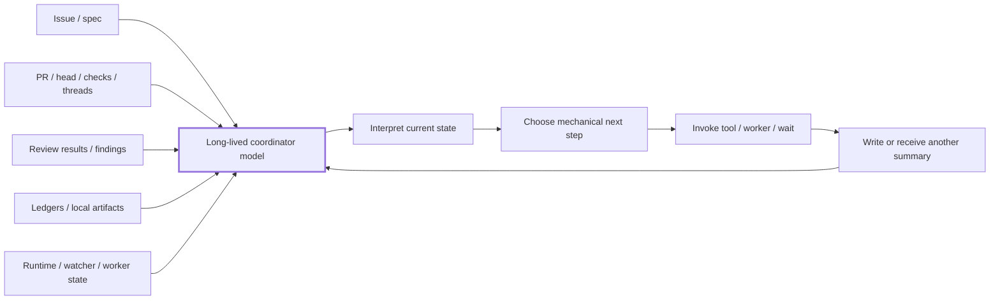

The model repeatedly reconciles facts that already have authoritative or machine-readable owners, narrates a transition, and then re-loads enough history to do the same thing again.

The desired topology is different:

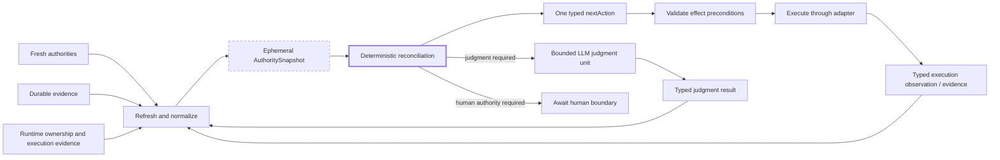

The architectural objective is therefore:

> Fresh authorities plus necessary durable evidence produce deterministic reconciliation, one typed next action, and compact evidence references. LLM contexts perform bounded semantic judgment only where judgment is actually required.

This record resolves the RFC in #2269 at the architecture-boundary level. It intentionally does **not** select an exact CLI name, module layout, serialized schema, or numerical token/call budget. Those remain implementation/configuration choices subject to the contract below.

The rule applies generally wherever dev-loop chooses a **mechanical lifecycle transition** from authoritative state. Delivery begins in the implementation subtree rooted at #2276, with the gate/coordinator reconciler owned by #2278. Existing domain owners are not implicitly authorized for wholesale rewrites.

Related work retains its existing ownership:

* [#2251](https://github.com/mfittko/dev-loops/issues/2251) owns carry-forward proof production and pre-dispatch enforcement.
* [#2204](https://github.com/mfittko/dev-loops/issues/2204) owns full validation-identity normalization before expensive validation.
* [#2270](https://github.com/mfittko/dev-loops/issues/2270) owns a compact deterministic gate-status projection.
* [#2157](https://github.com/mfittko/dev-loops/issues/2157) owns single-owner waits, cumulative execution budgets, and compact telemetry.
* [#2274](https://github.com/mfittko/dev-loops/issues/2274) remains a separate draft supervisor design and must consume this architecture rather than become a second workflow authority.

Historical dispatch incidents also constrain the design. In particular, #1907 records a parent run exceeding its 30-minute lifetime while legitimate reviewer work was still running, and #2065 records unmanaged background wait loops. Observation lifetime therefore cannot be treated as worker lifetime.

## Decision

### 1. Mechanical lifecycle transitions are owned by deterministic reconciliation

Mechanical dev-loop state transitions SHALL be derived by deterministic reconciliation over a normalized snapshot of authoritative inputs and validated evidence.

LLM contexts MAY perform bounded semantic judgment, but SHALL NOT serve as the workflow state machine or authority for mechanical phase advancement.

The architectural pipeline is:

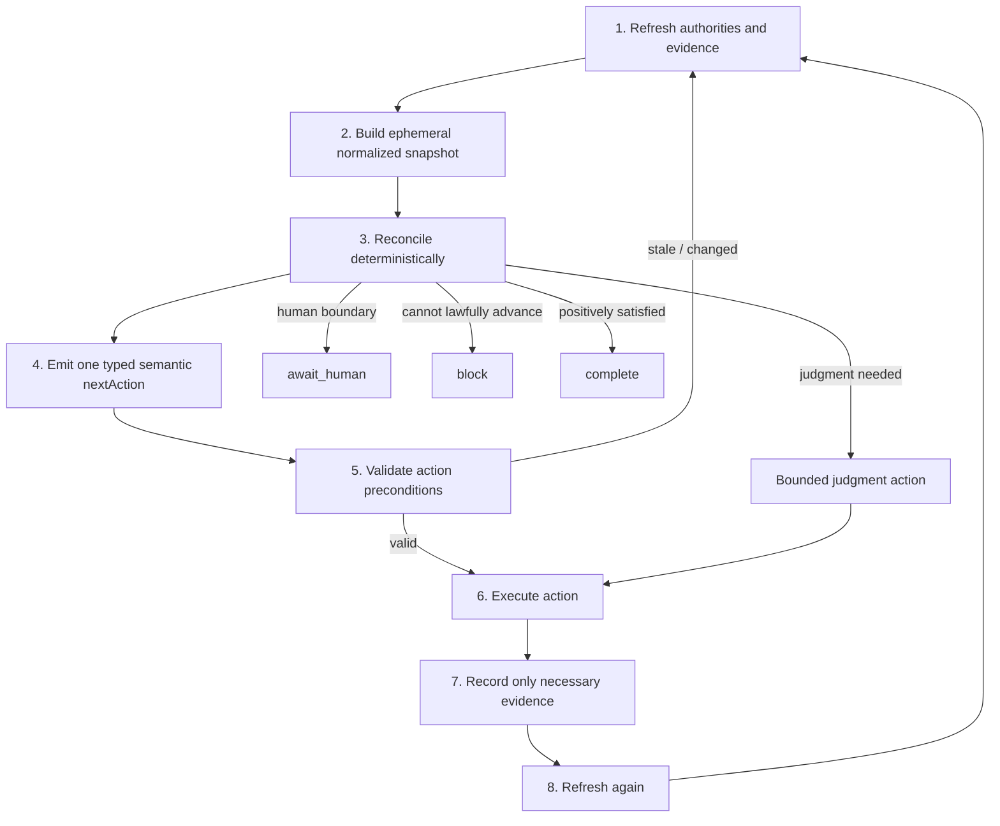

Reconciliation is a side-effect-free decision function. External reads that establish volatile authority belong to refresh. External mutations, worker dispatch, waiting, GitHub writes, checkpoint advancement, and other effects belong to execution.

Pure local deterministic helpers MAY run within reconciliation when they have no externally visible effect.

A reconciliation result is single-use with respect to the authority snapshot that produced it. Crossing an asynchronous or external boundary requires refreshing relevant volatile authority before another lifecycle transition is selected.

### 2. Authority, durable evidence, and projections are distinct

Each decision fact SHALL have one authoritative owner. Other representations are explicitly evidence, projections, caches, or telemetry.

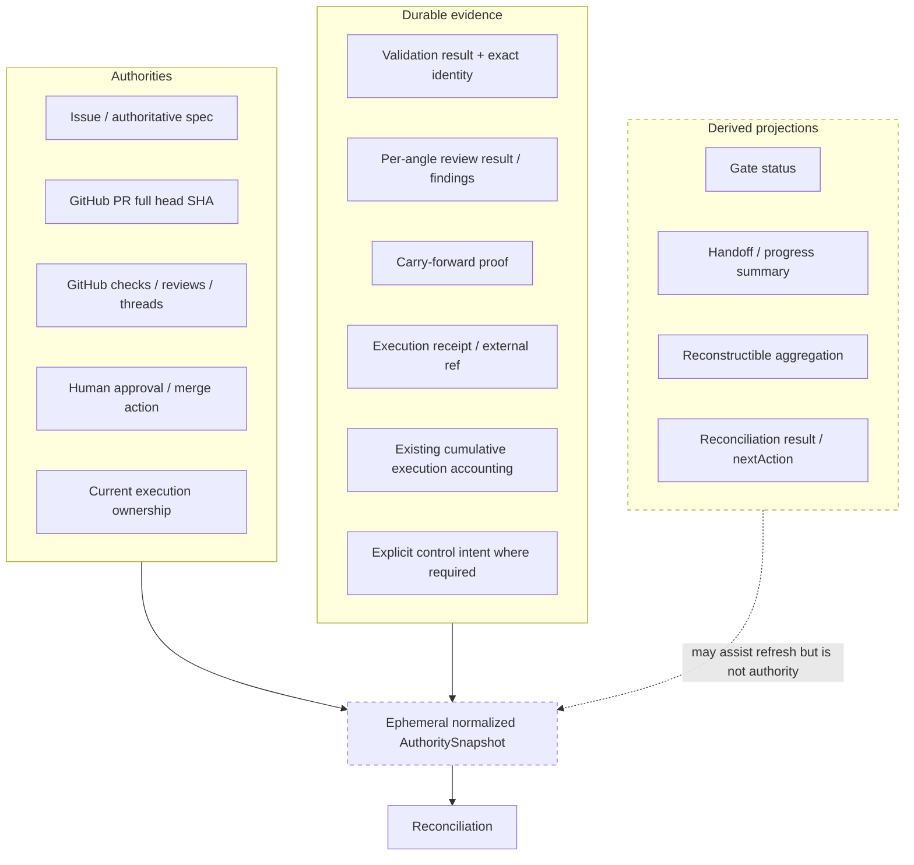

Examples of authority boundaries are:

* requirements and acceptance criteria: issue/spec of record;
* implementation revision: GitHub PR **full head SHA**, corroborated as required by the worktree;
* GitHub reviews, threads, and checks: GitHub;
* live effect owner: the sanctioned lease/adapter ownership mechanism;
* reviewer judgment: the validated per-angle judgment artifact for the identity reviewed;
* carry-forward eligibility: deterministic carry resolver plus its validated bridging proof;
* human approval: the human/GitHub action itself;
* usage/performance: existing execution telemetry and verified provider/harness measurements.

A projection MUST NOT become workflow authority merely because it is convenient to read.

In particular, #2270's gate status is an observational, deterministic, read-only projection. It may normalize coverage, execution, verdict, and evidence references, but it does not own lifecycle transition policy and does not become an authoritative `nextAction` store. The reconciler delivered under #2278 may consume its underlying library or its projection.

### 3. Refresh produces a first-class but ephemeral normalized snapshot

Refresh SHALL produce a compact normalized `AuthoritySnapshot` suitable for deterministic reconciliation.

Conceptually:

```text
AuthoritySnapshot {
  target
  workflowIdentity
  authorityFacts
  validatedEvidenceRefs
  executionLifecycle
  runtimeOwnership
  budgetState
  controlIntents
  provenance
}
```

The snapshot is:

* **ephemeral** — it SHALL NOT become a canonical `state.json`;
* **provenance-bearing** — normalized facts retain enough source identity to establish where they came from;
* **selective** — identities, classifications, counts, status, and references are preferred to bulk bodies;
* **validity-scoped** — it is used for one reconciliation epoch;
* **cacheable only as an optimization** — a cached snapshot cannot authorize a transition unless its constituent authorities remain valid.

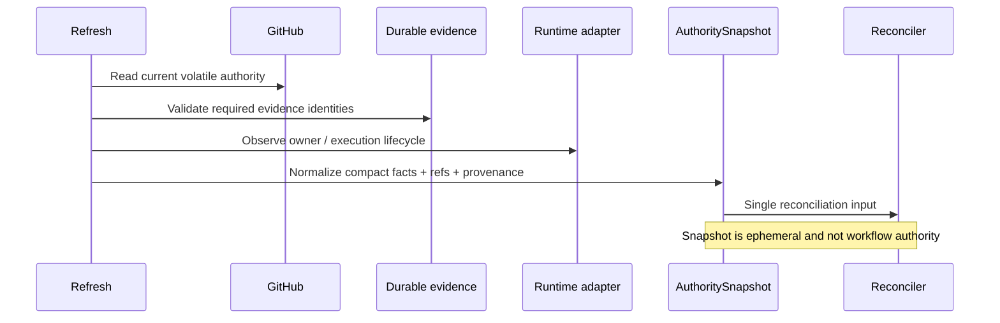

Normal reconciliation SHALL NOT require loading full findings, logs, source files, or historical transcripts when compact facts and references are sufficient.

### 4. Evidence validity uses semantic workflow identity, not head SHA alone

Evidence SHALL be valid against the semantic identity dimensions on which its contract depends.

Conceptually:

```text
WorkflowIdentity {
  target
  headSha
  specIdentity
  gate
  reviewConfigIdentity
  roundIdentity   // where same-head judgment briefing identity matters
}
```

The exact representation is an implementation detail.

Head SHA alone is insufficient. Relevant changes to specification identity, required review configuration, or same-head briefing identity may invalidate direct reuse even when code head is unchanged.

Identity is semantic: implementation SHALL NOT invalidate evidence merely because an unrelated projection byte changed.

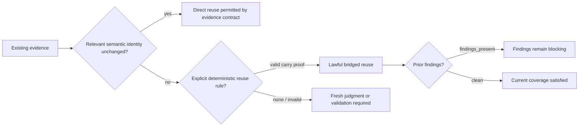

A head/spec/config identity change invalidates **direct** reuse unless a sanctioned deterministic rule bridges the change.

Carry-forward is one such bridge. This ADR does not restate its eligibility, missing-proof, or same-head round-retirement policy: those rules are already owned by `GATE-EXEC-ANGLE-CARRY-FORWARD` and `GATE-EXEC-ROUND-RETIREMENT` in [Gate Review Sub-Loop Contract](../../skills/docs/gate-review-sub-loop-contract.md), with the carry-forward decision recorded by ADR [0030](0030-angle-carry-forward-fail-closed.md) and ADR [0064](0064-carry-forward-findings-present-eligibility.md).

The architectural point here is narrower: deterministic reconciliation consumes the validated evidence those rules produce rather than re-deriving reuse eligibility in model context. Missing or invalid bridging proof never authorizes omitted work; reconciliation treats the affected judgment as fresh work under the owning rules above.

### 5. Reconciliation returns exactly one typed semantic next action

A domain reconciler SHALL emit exactly one typed semantic action or terminal outcome.

Conceptually:

```text
NextAction {
  kind
  actionId
  workflowIdentity
  contractIdentity
  preconditions
  reasonCodes
  evidenceRefs
  requiredReads
  arguments
}
```

Representative kinds include:

```text
refresh_authority
resolve_carry_forward
validate
prepare_dispatch
dispatch_units
wait_for_units
fan_in
invoke_reviewer
invoke_judge
invoke_fixer
block
await_human
complete
```

The exact action vocabulary is domain-owned.

"One action" means one **bounded semantic transition**, not one low-level syscall. A homogeneous bounded batch may be one action:

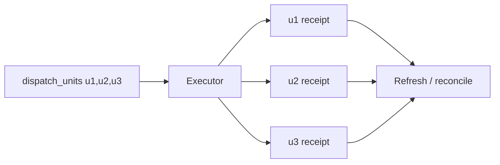

The system SHALL NOT force a new reconciliation after every item when a deterministic bounded executor can safely perform the whole semantic transition.

Each constituent externally significant unit still retains stable identity and recovery evidence.

Completion, blocking, and human boundaries are explicit typed outcomes:

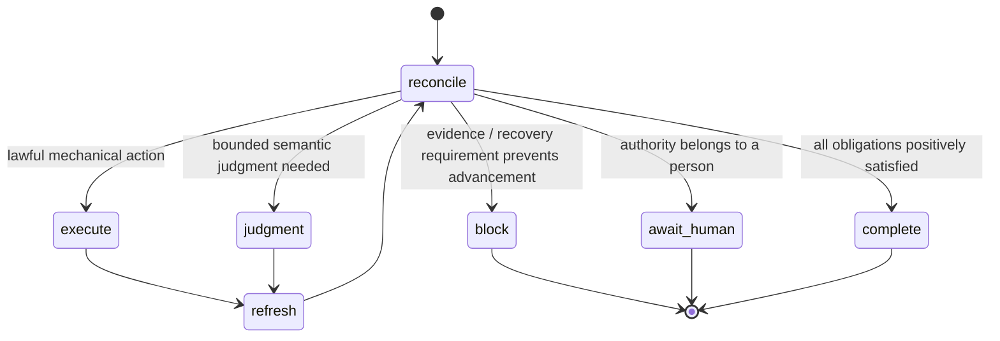

`complete` requires positive validated evidence that the relevant obligations are satisfied.

The absence of pending work, an empty unit list, or `0 expected == 0 complete` is not by itself evidence of success.

Unknown state is not clean state.

### 6. Every action carries machine-readable justification

Every reconciled action, including `block`, `await_human`, and `complete`, SHALL carry compact reason codes and supporting evidence references.

Human-readable explanation may be rendered from those facts, but prose itself has no workflow authority.

This makes the following question answerable without replaying a coordinator transcript:

> Why did this run dispatch, rerun, wait, block, advance, or complete?

The answer is the action identity, workflow identity, deterministic reason codes, and supporting evidence references.

A general proof-tree or narrative decision ledger SHALL NOT be introduced merely for this purpose.

### 7. Action choice has explicit deterministic precedence

When more than one transition appears permissible, the domain reconciler SHALL resolve the choice through explicit deterministic precedence.

Iteration order, filesystem order, model preference, or "first artifact found" behavior SHALL NOT determine lifecycle transitions.

Conceptually, a gate domain may prioritize categories such as:

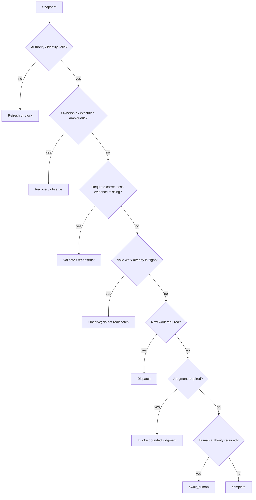

This diagram is illustrative, not a globally frozen precedence list. Each domain owns its actual ordering under the shared reconciliation contract.

For a fixed normalized snapshot and fixed reconciliation policy version, the result must be deterministic:

```text
same snapshot + same policy version = same nextAction
```

### 8. Reconciliation uses composable domain reconcilers, not a global god-object

This ADR standardizes the reconciliation protocol and invariants. It does not require one universal `reconcileEverything()` implementation.

Gate/coordinator reconciliation is the first implementation slice under #2276 and is owned by #2278. Other domains such as startup, routing, validation readiness, or future outer-loop control may adopt the protocol incrementally while retaining their existing policy ownership.

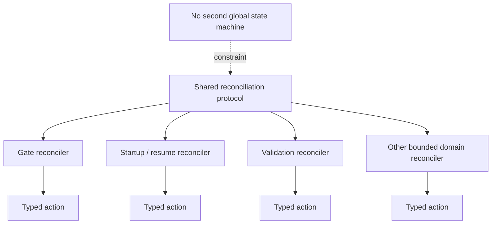

Cross-domain composition SHALL NOT create a second universal workflow-state authority.

### 9. External effects use optimistic preconditions, not a global workflow transaction

There is no atomic snapshot spanning GitHub, worktree state, runtime workers, and local evidence. A reconciled action can therefore become stale before execution.

Every effectful action SHALL carry the identities and preconditions on which reconciliation depended.

A separate precondition read followed by an effect is insufficient because authority can change between them. At the effect boundary, the adapter SHALL use either an authority-native conditional mutation or compare-and-act primitive, or an effect-scoped fencing token that the external effect system validates as part of the mutation. If the external system provides neither mechanism for a precondition whose violation could make the effect unlawful, automatic execution is unsupported and fails closed without attempting the effect.

```mermaid
sequenceDiagram
    participant R as Reconciler
    participant E as Executor
    participant A as Authority
    participant X as External effect

    R->>E: action + expected head/spec/owner/proof identities
    E->>A: Conditional mutation or validate effect fence

    alt Preconditions still match
        E->>X: Perform fenced / conditional effect
        X-->>E: Receipt / observation
    else Authority changed
        E-->>R: precondition_failed / stale_snapshot
        Note over R,E: No effect performed
    else Atomicity or fence unavailable / result unknowable
        E-->>R: conditional_effect_unsupported / execution_ambiguous
        Note over R,E: Block; do not infer success or choose another transition
    end
```

On a confirmed mismatch, the action performs no effect; the system refreshes and reconciles again. If the adapter cannot establish whether the condition held at the effect boundary or whether the effect occurred, it records `execution_ambiguous` and fails closed for explicit recovery. A post-effect re-read cannot retroactively prove the mutation was lawful.

This applies to reviewer dispatch, gate/checkpoint writes, fixer/developer actions tied to expected identity, lifecycle creation/advancement, lease-dependent effects, and approval/merge boundaries.

A global mutable phase lock or distributed workflow transaction is rejected. Current phase remains derived; narrow compare-and-act guards protect effects.

### 10. Effectful execution is stable, idempotent or reconcilable across crashes

Every effectful action SHALL have stable action identity sufficient for retry/recovery.

Where an external system supports idempotency, the adapter SHOULD use it.

Where it does not, the adapter SHALL preserve or reconstruct enough intent/receipt evidence to prevent blind duplicate effects.

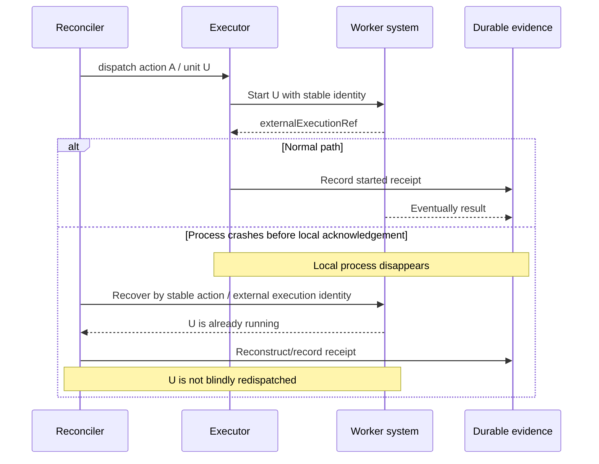

Recovery distinguishes, where possible:

```text
planned(actionId)
started(actionId, externalExecutionRef)
completed(actionId, resultRef)
```

These are execution evidence, not a phase state machine.

If execution can be proven not to have started, retry is allowed. If it is already active, resume observes it. If its state is genuinely ambiguous and duplicate execution is unsafe or expensive, recovery fails closed rather than guessing.

The architecture does not claim universal transport-level exactly-once semantics.

### 11. Effect ownership is narrow and fenced

Stable action identity alone does not prevent two orchestrators from acting on the same snapshot simultaneously.

Effectful actions therefore require a current owner/fencing precondition at the relevant run/domain scope.

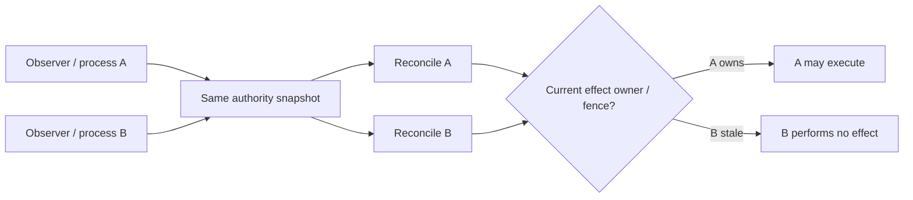

Multiple processes may observe or compute reconciliation results. Only the sanctioned current effect owner may mutate or dispatch for that ownership scope.

Ownership transfer does not imply cancellation or rerun. A new owner first reconstructs valid in-flight executions.

A lease is coordination evidence about **who may effect**, not workflow truth about **what state the work is in**.

### 12. Executors own mechanism, not lifecycle policy

Executors and harness adapters execute the reconciled action under its stated preconditions and return typed observations/results.

They MAY own bounded mechanism-level behavior that cannot change the lifecycle decision, such as:

* harness invocation;
* GitHub/API/CLI translation;
* idempotency keys;
* precondition checks;
* a bounded retry of the same idempotent transport request;
* receipt recording;
* mechanism-specific cancellation.

They SHALL NOT decide a different workflow action locally.

For example, an executor must not decide:

* "dispatch failed, therefore skip to judge";
* "the head changed but appears safe";
* "the waiter timed out, therefore rerun the worker";
* "validation failed, therefore invoke fixer";
* "zero units means clean."

Instead it returns a typed observation such as:

```text
precondition_failed
execution_started
execution_completed
execution_ambiguous
external_state_changed
transient_exhausted
cancelled
```

and control returns through refresh to reconciliation.

### 13. Judgment agents own semantic conclusions, not lifecycle transitions

Reviewers, judges, fixers, refiners, and other judgment roles retain their semantic responsibilities.

Their outputs SHALL cross the orchestration boundary as validated typed results, not free-form handoffs from which another model must infer what happened.

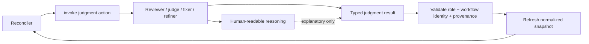

A common conceptual envelope is:

```text
JudgmentResult {
  executionIdentity
  workflowIdentity
  role
  outcome
  evidenceRefs
  completionStatus
  roleSpecificPayload
}
```

Role-specific payloads remain role-specific; this ADR does not mandate one universal findings schema.

Narrative text may explain a judgment but SHALL NOT itself advance lifecycle state.

A fixer's statement that a change is complete, for example, is not authoritative proof of the new implementation identity. Refresh establishes the actual worktree/head state and reconciliation decides what follows.

### 14. Reconciliation controls a bounded initial read set

When an action invokes judgment, reconciliation SHALL identify the minimal justified initial evidence set through `requiredReads`.

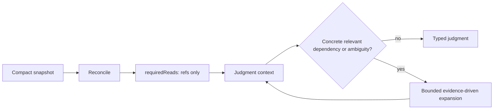

Mechanical reconciliation uses identities, classifications, counts, and references rather than bulk artifact bodies.

Judgment agents receive correctness-critical context, but SHALL NOT recursively load every ledger, prior summary, sibling result, or handoff merely because it exists.

`requiredReads` is not an evidence-starvation mechanism. Judgment MAY expand beyond the initial set when a concrete relevant dependency or ambiguity requires it. Such expansion remains bounded and task-relevant.

### 15. There is no universal durable continuation checkpoint

Resume is reconstruction from authorities and owner-scoped durable evidence, not restoration of a canonical phase pointer.

A general-purpose durable object like this is rejected:

```text
run-state.json {
  phase
  nextAction
  currentHead
  remainingUnits
  verdict
  ...
}
```

Those fields would duplicate facts with existing owners and eventually become competing authority.

Instead:

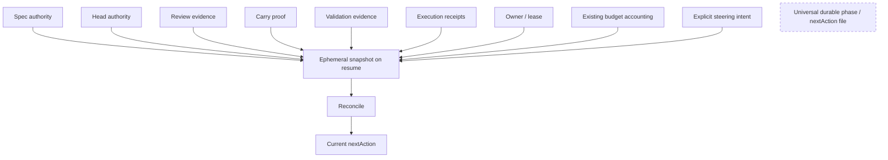

New durable facts are justified individually only when losing them would make correct reconstruction impossible or genuinely ambiguous.

Examples include an external execution receipt that the harness cannot rediscover or existing cumulative budget counters.

Where an existing owner already persists that fact, delivery under #2276 SHALL reuse it rather than introduce a second ledger.

Remaining work SHOULD normally be derived:

```text
required work
- valid completed/carry evidence
- valid in-flight executions
= work still required
```

rather than stored as another authoritative list.

### 16. Recovery regenerates derivable state and fails closed for missing unique evidence

Recovery follows this classification:

* cheap deterministic projections: regenerate;
* volatile authority: refresh;
* deterministic proof: reconstruct where possible;
* missing unique semantic judgment: rerun that bounded judgment if still required;
* missing validation for the current exact identity: revalidate;
* execution receipt: query/reconstruct through the adapter when possible;
* genuinely ambiguous execution: block/recover rather than guess;
* human approval: never infer;
* cumulative budgets: preserve; never reset because context restarted.

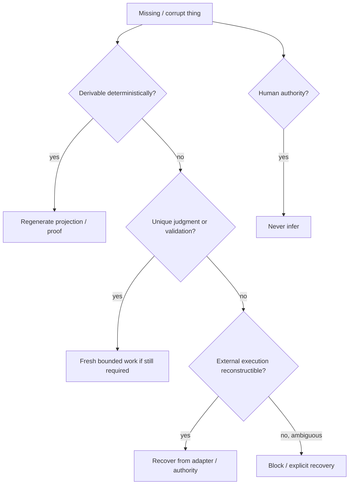

An old review for an old head remains valid historical evidence for that old identity. Missing current carry proof prevents treating it as current evidence; deterministic carry proof may be regenerated and then lawfully bridge the identities.

### 17. Waiting is model-free and observation lifetime is independent of worker lifetime

External waits have one sanctioned owner. Normal progress polling SHALL NOT require repeated model turns.

Observation lifetime and worker lifetime are separate concepts.

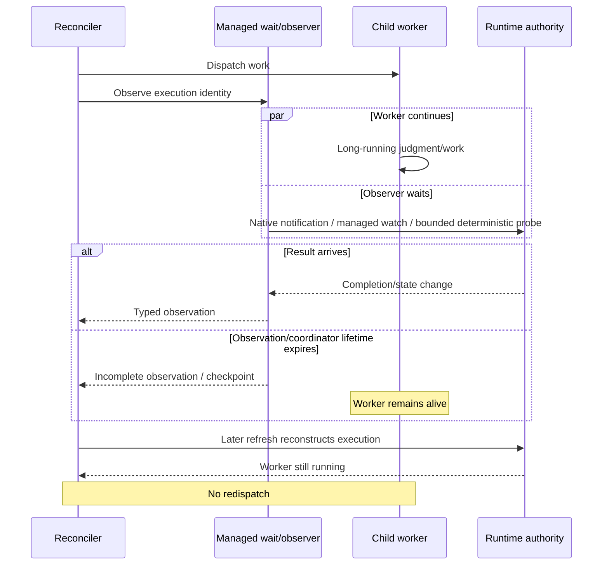

Expiration of a wait, watcher, coordinator invocation, observation lease, or parent runtime SHALL NOT terminate an otherwise valid child execution.

Worker termination may occur only under:

* an explicit work-unit execution deadline; or
* an explicit sanctioned cancellation policy.

A wait timeout means only that the condition was not observed within the observation interval. It does not imply worker failure.

Native event/notification mechanisms are preferred where available. Managed resumable observation or bounded deterministic polling is acceptable underneath an adapter. Unmanaged background `sleep`/`until` loops are not.

### 18. Budgets are cumulative safety invariants, not the optimization mechanism

Execution limits remain mandatory safeguards but are subordinate to removing unnecessary model-mediated transitions.

Budgets:

* survive continuation and fresh contexts;
* cannot be reset by restarting a coordinator;
* block further work when exhausted;
* never authorize advancement;
* record consumed and remaining quantities where available;
* represent unavailable metrics as unavailable rather than zero or estimates.

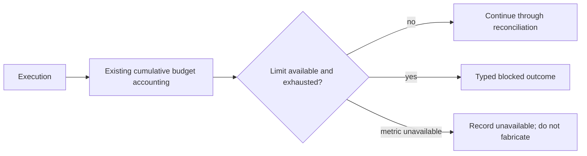

This ADR does not freeze numeric thresholds. Existing #2157 limits and any future #2276 benchmark configuration remain configurable/evidence-driven policy.

### 19. Contract and policy identity are explicit and separate from workflow identity

Snapshots, action envelopes, and durable execution evidence SHALL carry sufficient contract identity to determine the semantics under which they were produced.

Semantic changes to identity meaning, transition precedence, action meaning, or evidence validity require an explicit contract/policy version change. Internal refactors that preserve observable semantics do not.

Conceptually:

```text
WorkflowIdentity   = what work/evidence is about
ContractIdentity   = how its envelope/semantics are interpreted
PolicyVersion      = which deterministic transition policy selected an action
```

Policy version SHALL NOT itself become part of semantic workflow identity.

A software deployment therefore does not invalidate valid reviewer evidence merely because reconciliation code changed.

### 20. In-flight runs use the current policy with explicit compatibility rules

On resume after an orchestration upgrade:

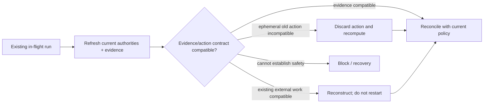

Existing durable evidence is accepted according to explicit compatibility rules. It is not invalidated merely because orchestration code changed.

An incompatible **ephemeral** action is abandoned and recomputed.

Already-started valid external work is reconstructed from its receipt/authority rather than implicitly restarted.

Runs do not need to remain pinned for hours to the orchestration implementation they started under.

### 21. Steering and cancellation are typed control inputs to reconciliation

Human or future supervisor steering SHALL enter through an explicit typed control boundary.

Conceptually:

```text
ControlIntent {
  scope
  kind
  identity
  requestedBy
  requestedAt
}
```

Examples include stop-at-safe-boundary, suppress-future-dispatch, cancel-pending-work, or require-human-review.

Steering changes what actions are lawful; it does not directly mutate a lifecycle phase.

```mermaid
flowchart LR
    H[Human / supervisor] --> C[Typed ControlIntent]
    C --> S[AuthoritySnapshot]
    S --> R[Reconciliation]
    R --> N[Next lawful action]

    C -. never directly .-> X[Lifecycle phase mutation]
```

Pending work may be suppressed where policy permits.

Running work continues unless an explicit cancellation policy authorizes its termination.

Cancellation timeout does not establish that a worker died.

Completed evidence remains evidence if its semantic identity remains valid.

Cancellation is not rollback.

### 22. A future supervisor observes and steers; it is not a parallel workflow authority

A supervisor such as that explored by #2274 may:

* observe authoritative state, evidence, telemetry, and reconciled outcomes;
* detect a stalled or pathological run;
* request refresh/reconciliation;
* surface a human decision;
* submit sanctioned typed control intents.

It SHALL NOT independently determine mechanical lifecycle transitions, reconstruct phase from transcript, or maintain a competing current-state authority.

```mermaid
flowchart TB
    A[Authorities + evidence] --> R[Deterministic reconciliation]
    R --> X[Typed lifecycle action]
    X --> E[Executor / runtime]
    E --> A

    A --> S[Supervisor]
    R --> S
    T[Telemetry] --> S

    S -->|request refresh / typed steering| A

    S -. prohibited .-> X
    S -. no parallel phase authority .-> P[Independent workflow state]
```

This ADR does not decide whether #2274 will be implemented.

### 23. Migration is fixture-first, shadowed briefly, then cut over quickly

Shadow comparison is a migration instrument, not a long-lived operating mode.

The migration SHALL proceed as follows:

```mermaid
flowchart TD
    IMPLEMENT[Implement gate reconciler + contract tests]
    FIX[Run deterministic fixture matrix]
    FG{All required fixtures green?}

    LIVE1[Live pilot 1: ordinary gate]
    LIVE2[Live pilot 2: narrow head bump / carry]
    LIVE3[Live pilot 3: interruption/resume or long-running worker]

    DIV{Any unexplained mechanical divergence?}
    FIXDIV[Fix reconciler / fixture / identified contract bug]
    CUT[Cut over gate/coordinator authority]
    STRESS[Post-cutover broad stress + benchmark]
    RETIRE[Retire legacy authority / temporary shadow compatibility]

    IMPLEMENT --> FIX --> FG
    FG -->|no| FIXDIV --> FIX
    FG -->|yes| LIVE1 --> LIVE2 --> LIVE3 --> DIV
    DIV -->|yes| FIXDIV
    DIV -->|no| CUT --> STRESS --> RETIRE
```

The required deterministic fixture matrix includes at least:

* fresh start;
* normal same-head resume;
* narrow head bump;
* spec identity change;
* review-config identity change;
* partial carry;
* all-carried clean;
* all-carried `findings_present`;
* preparation completed but no worker started;
* partial batched dispatch;
* process crash after external dispatch but before receipt acknowledgement;
* interruption while a valid long-running worker remains alive;
* wait/coordinator lifetime expiry without worker cancellation;
* stale snapshot/precondition failure;
* ownership takeover/fencing;
* missing/corrupt cheap projection;
* missing/corrupt unique judgment evidence;
* missing current carry proof;
* validation identity mismatch;
* same-head changed briefing with explicit round retirement;
* head change during wait;
* typed stop/cancellation at a safe boundary;
* human approval boundary;
* incompatible old ephemeral action after policy upgrade.

Shadow mode:

* reads the same normalized snapshot;
* computes the reconciler's action;
* performs **no duplicate effect**;
* is observational only.

The live shadow sample is deliberately small:

1. one ordinary gate;
2. one narrow fixer/head-bump case exercising carry-forward;
3. one interruption/resume or legitimate long-running-worker case.

Cutover occurs as soon as:

* the required deterministic fixture matrix is green; and
* the three designated live pilots have **zero unexplained mechanical divergences**.

A divergence does not require reproducing a known legacy bug. If the old path is demonstrably inconsistent with the authoritative contract and the reconciler is correct, the discrepancy is recorded as an explained parity exception.

No percentage token reduction or broad stress benchmark blocks this initial correctness cutover.

After those gates pass, the gate/coordinator domain switches immediately to the reconciler as its sole mechanical transition authority.

Broad #2237-like stress and efficiency measurement occur **after** cutover.

Temporary shadow/rollback compatibility MUST NOT become permanent dual control. It must be removed by #2284 after the post-cutover broad stress run confirms the new path's correctness and recovery invariants.

### 24. Cutover authority is exclusive; rollback is explicit

After a domain cuts over, the reconciler is its sole mechanical transition authority.

An invariant failure, unsupported state, malformed output, or reconciliation defect SHALL fail closed. It SHALL NOT automatically fall back to the legacy conversational coordinator.

```mermaid
flowchart TD
    NEW[Reconciler is active authority] --> Q{Invariant / runtime defect?}
    Q -->|no| RUN[Continue]
    Q -->|yes| B[Block safely + expose reason/evidence]

    B --> F[Fix forward]
    B --> OR[Explicit operator rollback at safe boundary]

    OR --> REF[Refresh / reconstruct current authority + in-flight executions]
    REF --> OLD[Legacy path becomes sole authority temporarily]

    NEW -. forbidden automatic fallback .-> OLD
```

Emergency rollback is an explicit authority switch at a safe boundary.

Rollback:

* preserves existing authority and evidence;
* does not reset the run;
* reconstructs valid in-flight executions;
* does not duplicate or implicitly cancel workers;
* never runs old and new mechanical transition authorities concurrently.

Diagnostic shadow comparison may remain temporarily read-only, but cannot influence execution.

### 25. Rejected alternatives

We reject **long-lived conversational orchestration plus compaction as the primary fix**. Compaction may help individual contexts but leaves mechanical lifecycle authority inside a model and does not eliminate repeated low-information transitions.

We reject **stage-scoped fresh LLM coordinators as the state machine**. Fresh contexts are appropriate for bounded semantic judgment, but moving mechanical reconciliation into a sequence of smaller conversations still requires models to interpret state and creates handoff pressure.

We reject a **universal durable workflow-state/checkpoint document**. It would duplicate GitHub, spec, review, validation, execution, lease, and budget facts and become another authority requiring reconciliation.

We reject making **#2270 status the lifecycle authority**. Status is a compact observation/projection; transition policy remains in reconciliation.

We reject a **global workflow lock or distributed transaction** across GitHub, worktree, local evidence, and external agents. Narrow ownership/fencing plus action preconditions make stale actions harmless without inventing a global transaction boundary.

We reject claiming **universal exactly-once worker dispatch**. Stable action identity, idempotent APIs where available, execution receipts, and fail-closed ambiguity provide safe workflow behavior without making an unsupportable transport guarantee.

We reject **model-mediated normal progress polling**. Wait/watch belongs to deterministic runtime mechanisms.

We reject requiring **event-driven infrastructure everywhere**. Native notifications are preferred, but managed resumable observation or bounded deterministic probing is an acceptable adapter implementation.

We reject **big-bang migration** because it makes correctness failures harder to localize.

We also reject **permanent dual control or open-ended shadowing** because it taxes velocity, doubles orchestration complexity, and recreates competing authority.

## Consequences

### Mechanical orchestration becomes replayable and auditable

Given the same normalized snapshot and policy version, reconciliation selects the same action. Lifecycle decisions can be fixture-tested without launching a model or external worker.

Operators can answer why a workflow advanced by inspecting action identity, reason codes, and evidence references rather than reconstructing a transcript.

### Coordinator context ceases to be required workflow memory

The coordinator no longer needs to remember previous head, unit counts, completed phases, carry eligibility, or worker status in conversation history.

Long-lived model history can be discarded without losing mechanical workflow truth.

### Semantic judgment remains model-powered

This decision does not attempt to make code review, adjudication, fixing, requirements refinement, or other semantic tasks deterministic.

It moves only the **cross-unit and lifecycle transition authority** into code.

Reviewer independence and current evidence requirements remain unchanged.

### Context composition becomes intentional

Judgment contexts begin from bounded `requiredReads` rather than inherited conversation history.

Full findings, logs, and source remain available when required; the architecture avoids loading them into every mechanical transition.

### Persistence becomes narrower but more meaningful

The system must be disciplined about distinguishing durable evidence from convenient state copies.

Adapters may need better execution receipts or reconstruction APIs where current harnesses make worker state ambiguous after interruption.

That is intentional: unreconstructible external execution identity is a legitimate durable fact; "we are currently in phase review" is generally not.

### Recovery code becomes more explicit

Crash and resume behavior must cover:

* stale preconditions;
* partial batch execution;
* lost acknowledgements;
* ownership takeover;
* still-running workers;
* incompatible old action envelopes;
* missing projections versus missing unique evidence.

This increases deterministic code and fixture work, but removes those decisions from ad hoc model reasoning.

### Wait behavior becomes safer

A coordinator or watcher can terminate or checkpoint without killing healthy long-running work.

This corrects the coupling exposed by prior timeout incidents, at the cost of requiring harness adapters to expose enough stable execution identity for later reconstruction.

### The execution boundary becomes stricter

Adapters cannot silently embed workflow policy. Conditions that change the lawful lifecycle action must return to refresh/reconciliation.

Some existing helpers may therefore need to split "mechanism" from "what should happen next."

### Budgets remain important but become a backstop

Reducing unnecessary model transitions is the primary efficiency mechanism.

Budgets protect against regressions and runaway execution; they are not the architecture itself.

### Software upgrades do not require draining active runs

Current policy can reconcile older valid evidence under compatibility rules.

Old ephemeral actions that cannot be interpreted safely are recomputed instead of forcing a whole-run version pin.

### A future supervisor has a clear seam

#2274 may add intelligent observation and intervention without becoming a second lifecycle authority.

This makes a supervisor useful for anomaly detection and steering while preventing it from recreating the same long-lived state-reconciliation problem at a higher layer.

### Delivery is intentionally aggressive

The first delivery slice under #2276 is not required to migrate every dev-loop domain before delivering value.

The delivery path is:

```mermaid
flowchart LR
    A[#2251 carry proof<br/>and #2204 identity work] --> B[#2270 honest compact projection]
    B --> C[#2278 gate reconciler implementation]
    C --> D[Fixture matrix]
    D --> E[3 bounded live pilots]
    E --> F[Immediate gate/coordinator cutover]
    F --> G[Broad post-cutover stress + efficiency benchmark]
    G --> H[Remove legacy authority / temporary shadow]
```

Architecture is decided before #2270's projection shape is frozen as a runner API, while practical delivery can continue through #2251 → #2270 → #2278 under the #2276 implementation epic.

The efficiency epic does not wait for the future supervisor, a generalized workflow engine, Codex production support, or an arbitrary numerical savings target.

### Verification and cutover criteria are correctness-first

The switch is not based on subjective confidence or elapsed shadow time.

The gate/coordinator reconciler becomes authoritative when:

1. the specified deterministic replay matrix is green;
2. the ordinary live gate pilot is clean;
3. the narrow carry-forward pilot is clean;
4. the interruption/resume or long-running-worker pilot is clean; and
5. there are zero unexplained lifecycle divergences.

Broad stress benchmarking then tests scale and measures the efficiency win on the architecture that is actually going to ship.

Measurement SHOULD reuse #2157 telemetry and separately report, where available:

* logical model turns;
* provider/API attempts;
* uncached input;
* cached input;
* output/reasoning under the harness's semantics;
* peak context;
* coordinator versus child totals;
* model-mediated transition count;
* tool calls;
* artifacts and bytes read per reconciliation;
* reviewer units emitted and rerun;
* validations per exact identity;
* local-tool wall/CPU time;
* child wall time;
* actual billed cost where independently available.

Unavailable metrics remain unavailable.

No unmatched run, account-wide allowance movement, or unreconciled provider token field is evidence of a quantified saving.

### Summary of the authority boundary

```mermaid
flowchart TB
    subgraph INPUT[Truth and durable evidence]
        A1[Authoritative spec]
        A2[GitHub head/checks/reviews]
        A3[Validated review/carry/validation evidence]
        A4[Execution receipts and ownership]
        A5[Cumulative budgets and typed control intent]
    end

    INPUT --> SNAP[Ephemeral normalized snapshot]
    SNAP --> REC[Deterministic domain reconciler]

    REC --> MECH[Typed mechanical action]
    REC --> JUDGE[Bounded judgment action]
    REC --> HUMAN[Human boundary]
    REC --> BLOCK[Blocked recovery]
    REC --> DONE[Positive completion]

    MECH --> EXEC[Policy-free executor / adapter]
    JUDGE --> AGENT[Judgment agent]
    AGENT --> RESULT[Typed result]

    EXEC --> INPUT
    RESULT --> INPUT

    SUP[Optional supervisor] -->|observe| INPUT
    SUP -->|typed steering| INPUT

    TRANSCRIPT[Coordinator narrative / transcript]:::ephemeral
    STATUS[Status / handoff projections]:::ephemeral

    TRANSCRIPT -. no authority .-> REC
    STATUS -. compact input only .-> SNAP

    classDef ephemeral stroke-dasharray: 5 5
```

The resulting invariant is:

> **Authoritative current state and necessary durable evidence are refreshed into a compact ephemeral snapshot; deterministic domain reconciliation selects one justified semantic next action; guarded executors perform effects; bounded agents perform only semantic judgment; and every asynchronous boundary returns through fresh authority rather than conversational memory.**
