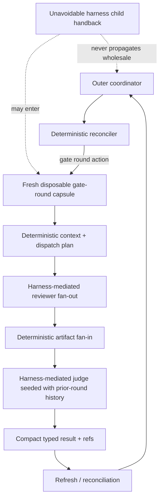
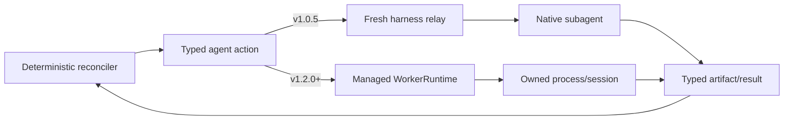

# 0081. Harness-mediated agent I/O is context-contained until the runtime owns worker processes

## Status

Accepted — 2026-09-23 ([PR 2344](https://github.com/mfittko/dev-loops/pull/2344))

Amends [ADR 0074](./0074-deterministic-reconciliation-owns-mechanical-transitions.md). ADR 0074's authority model and deterministic lifecycle-policy decision remain accepted. This record narrows the execution claim: under the current Pi and Claude harnesses, dev-loops does not own native subagent process I/O.

## Context

Source: [issue 2342](https://github.com/mfittko/dev-loops/issues/2342).

ADR 0074 correctly moved mechanical lifecycle **policy** out of a long-lived model transcript and into deterministic reconciliation. During implementation planning, #2278/#2279 sharpened that into a proposed “deterministic driver” that would prepare fan-out, spawn reviewers, await them, capture their results, fan-in, invoke a judge, and return only a compact packet to the outer coordinator.

The problem is the agent/tool I/O seam.

Native reviewer, judge, fixer, and refiner workers are created by the host harness. A shell or Node helper can prepare their inputs and consume persisted outputs, but it cannot itself invoke the harness's native subagent primitive or guarantee that the harness will not return child output into the invoking agent's transcript. Existing repository contracts already encode that limitation:

- gate fan-out is dispatched through the harness Agent/subagent facility;
- reviewer request bytes must contain the sanctioned emitted briefing prefix inline/verbatim for request-prefix/cache identity;
- delivery of those bytes to the actual child is a best-effort harness boundary that tooling cannot independently verify;
- worker lifetime/reconstruction differs by harness and is not universally available.

Treating those limitations as if dev-loops already owned a process API would create a false abstraction and could force implementation toward an unrecoverable dead end.

The v1.2.0 container/session runtime (#715, #717, #723) is the appropriate milestone for adding a process/session ownership seam. It already introduces independent session lifecycle management. A future worker interface can build on that runtime and on the bounded work-order/result-capture shape explored by #1446. That capability is intentionally not pulled into v1.0.5.

## Decision

### 1. Separate policy ownership from execution capability

Deterministic reconciliation owns **mechanical lifecycle policy and next-action selection**.

Execution is classified by capability:

| Capability | Definition | v1.0.5 posture |
| --- | --- | --- |
| `tool_owned` | dev-loops directly executes a deterministic helper/API/CLI/filesystem effect | Execute in tooling |
| `harness_agent` | reconciler selects a typed agent action, but the host harness must spawn/join the native worker | Execute through a bounded fresh relay/capsule |
| `process_owned` | dev-loops launches, supervises, and captures the model/session process itself | Deferred to v1.2.0 runtime work |

A `harness_agent` action is not relabeled as `tool_owned` merely because deterministic code prepared its prompt or will later consume its artifact.

### 2. v1.0.5 optimizes context containment, not fictitious process ownership

For native reviewer/judge/fixer/refiner actions, the execution unit is a **fresh disposable capsule**.

A gate review round is the primary capsule boundary:



The capsule MAY receive unavoidable child handback in its own transcript because the harness owns that delivery. The capsule SHALL be short-lived and SHALL NOT propagate raw reviewer/judge transcripts or bulk findings into the outer coordinator.

The capsule's freshness is a claim about the outer coordinator's transcript, not about the judge's inputs: per `GATE-EXEC-JUDGE-NOT-FRESH`, the judge inside the capsule is seeded with prior-round ledgers and judge verdict artifacts as explicit durable input, and reviewer fresh-context isolation is unchanged by this decision.

The outer coordinator receives compact typed results and references only.

The capsule is an executor under ADR 0074 Section 12: it follows the deterministic dispatch plan only, and on any non-happy observation (dispatch failure, a blocked or missing unit, fan-in failure, or a head change) it stops and returns a typed observation to refresh/reconciliation rather than choosing the next step itself.

### 3. Artifacts are semantic inputs; harness handback is non-authoritative

Reviewers and judges continue to emit validated artifacts/envelopes.

Deterministic fan-in and later reconciliation consume those persisted artifacts and references. A native harness returning prose to the relay does not make that prose authoritative and does not require the next semantic consumer to re-read it from the relay transcript.

The enforceable invariant is therefore:

> Semantic consumers use validated artifacts/references; unavoidable native-agent handback is confined to the disposable harness relay and is not propagated upward as workflow memory.

The stronger statement “subagents never return prose to a parent context” is not an enforceable v1.0.5 invariant.

### 4. Reviewer input-by-reference stops at the capsule boundary

Reference-based handoff is appropriate between the outer coordinator and the capsule: the outer coordinator should pass identities, paths, and compact action arguments instead of bulk gate context.

It is **not** a replacement for the existing reviewer briefing contract.

Where `GATE-EXEC-BRIEFING-PREFIX` requires the canonical shared prefix to be inline and byte-identical in the actual reviewer request, the capsule SHALL dispatch the sanctioned emitted prompt bytes unchanged. A path-only reviewer request is not equivalent and would break request-prefix/cache semantics. (Issue #1462 separately keeps the handoff-envelope prefix byte-stable; it does not govern this inline reviewer-request rule.)

### 5. Observation and recovery are capability-honest

Model-free observation remains the preferred mechanism where the harness/runtime exposes native notification, resumable observation, or reconstructible execution identity.

Where a native harness does not expose enough identity/lifetime control to reconstruct a child after coordinator loss, the adapter SHALL report an explicit unsupported or ambiguous capability and fail closed. It SHALL NOT fabricate durable worker identity or claim process ownership.

This amends the interpretation of ADR 0074 Sections 10, 11, 12, 16, and 17 without changing their fail-closed intent.

### 6. v1.2.0 owns the process/session I/O seam

True tool-owned agent orchestration requires a runtime interface conceptually like:

```text
WorkerRuntime {
  start(workOrder) -> executionRef
  observe(executionRef) -> typed status
  collect(executionRef) -> resultRef
  cancel(executionRef) -> typed acknowledgement
}
```

That interface owns process/session lifecycle, bounded input, result capture, execution identity, and reconstruction.

Its delivery belongs with the v1.2.0 runtime/containerization work (#715), not with #2279 in v1.0.5.

#715 currently says native Pi subagents remain child processes inside Pi; therefore containerization alone does not automatically provide this seam. The v1.2.0 design must explicitly decide which worker types become process/session-owned.

#1446's external model-CLI adapter is relevant prior art because it already describes subprocess spawn, bounded work-order input, and typed result capture. Production use of that ownership model before the v1.2.0 runtime boundary is outside this decision.

### 7. Migration/cutover wording changes

The v1.0.5 cutover target is:

- deterministic reconciliation is the sole mechanical **policy/next-action authority**;
- directly tool-owned effects execute without model mediation;
- native agent actions execute only through bounded fresh harness-relay capsules;
- gate-round payloads do not accumulate in the outer coordinator;
- unsupported observation/recovery capabilities fail closed.

It is **not** a requirement that every native-agent spawn/join be model-free or tool-owned.

The post-cutover benchmark therefore separates:

- outer coordinator;
- disposable gate-round relay/capsule;
- reviewer/judge/fixer semantic children;
- deterministic tool calls.

Zero model-selected mechanical transitions remains required. Zero model turns for native harness spawn/join is not a v1.0.5 requirement.

This amends ADR 0074 Sections 23 and 24 and the "Verification and cutover criteria" consequence: the migration/cutover target and the post-cutover benchmark are narrowed as stated above, without changing their fixture-first, exclusive-authority intent.

## Consequences

### v1.0.5 remains high-value

The primary context-snowball is bounded even when a harness insists on returning child output into the invoking agent. That payload dies with the gate-round capsule instead of accumulating in the long-lived coordinator.

The deterministic policy work remains reusable.

### The implementation subtree becomes capability-honest

#2278 owns gate policy.

#2279 owns the capability/relay boundary rather than pretending to own native subagent processes.

#2280/#2281 promise reconstruction/observation only where the harness/runtime exposes sufficient identity.

#2283 cuts over policy authority plus context containment.

#2284 measures outer-coordinator reduction separately from disposable relay cost.

### v1.2.0 gets a clean upgrade path

The reconciler/action/artifact contracts do not need to change when a managed worker runtime appears. The executor for a `harness_agent` action can later become a `process_owned` worker adapter while preserving the semantic action and result contracts.



## Non-goals

- Reversing ADR 0074's deterministic-policy decision.
- Implementing worker process/session ownership in v1.0.5.
- Weakening gate, evidence, carry, validation, reviewer-independence, or human-approval semantics.
- Replacing semantic judgment agents with deterministic code.
- Treating path references as a substitute for required inline reviewer request bytes.
- Claiming universal worker reconstruction where a harness does not expose it.
