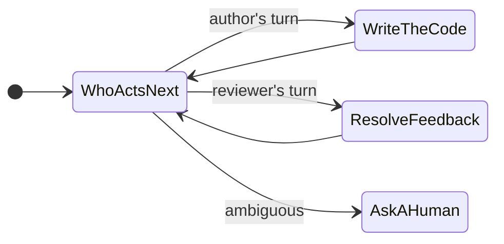
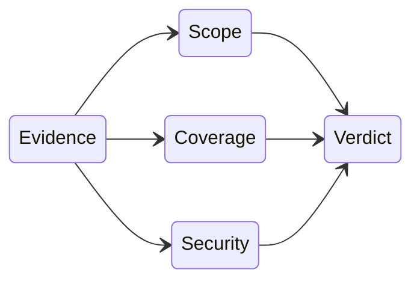

  
dev-loops

  <h1>Eliminating Coordination Delay in AI-Assisted Dev Workflows</h1>
  
AI agents made writing code cheap. The handoffs around the code — author to reviewer, reviewer to CI, CI back to a human — are where hours quietly leak and where agents guess wrong. dev-loops turns every handoff into a decision you can see.

---

The core idea

## Loops Inside Loops

<ul class="tight-list">
  <li><strong>Who acts next?</strong> An outer loop decides, every cycle, which role takes the work — and makes exactly one move at a time.</li>
  <li><strong>The PR's life.</strong> An inner loop walks each pull request from first draft to merged, one explicit step at a time.</li>
  <li><strong>The feedback.</strong> A second inner loop tracks every review comment from raised to resolved, so nothing gets lost.</li>
  <li>When the situation is ambiguous, it stops and asks. <em>Ambiguity never becomes a guess.</em></li>
</ul>

One move per cycle

---

Safe pauses

## Pauses Only at Safe Boundaries

<ul class="tight-list">
  <li><strong>Pause now</strong> — it's safe to hand control to a human this instant.</li>
  <li><strong>Pause at the next clean boundary</strong> — finish the step in flight first, then stop.</li>
  <li><strong>Can't continue</strong> — a required check is missing, so the work refuses to move.</li>
  <li>A pull request <em>cannot</em> advance past a review that was never actually run. The gate fails closed.</li>
</ul>

Example

You ask it to stop. If it's mid-edit, it doesn't drop the file — it tags the request <code>stop_at_next_safe_gate</code> and pauses the moment the current step lands clean. You get a tidy stopping point, not a half-written change.

---

Mid-flight steering

## Change the Rules Mid-Run

<ul class="tight-list">
  <li><strong>A hard rule</strong> — a constraint the next steps must obey.</li>
  <li><strong>A preference</strong> — a nudge it tries to honor when it can.</li>
  <li><strong>A question</strong> — a clarification it folds into its next move.</li>
  <li><strong>Stop when safe</strong> — wind down at the next clean boundary.</li>
</ul>

Example

Halfway through, you say <em>"don't touch the auth module."</em> It lands as a <code>hard_constraint</code> the remaining steps must honor — no restart, no lost progress, the rule simply takes effect from the next move on.

---

Parallel review

## Many Reviewers, One Verdict

<ul class="tight-list">
  <li>Every reviewer reads the <strong>same evidence bundle</strong> — the same diff, the same context — so their verdicts are directly comparable.</li>
  <li>Each looks from a different angle (scope, test coverage, security) at the same time.</li>
  <li>The findings merge into <strong>one verdict</strong>.</li>
  <li>A single serious finding <em>blocks the merge</em> — one no is enough.</li>
</ul>

Same evidence in, one verdict out

---

It never lies about being done

## "Done" Means Merged

A human merges

<ul class="mini-list">
  <li>The agent never merges its own work.</li>
  <li>At the final gate it hands the PR to a named person.</li>
  <li>A human always owns the last yes.</li>
</ul>

"Done" is real

<ul class="mini-list">
  <li>The board shows <em>done</em> only when a PR actually merged.</li>
  <li>It reads a real merge signal — it can't fabricate one.</li>
  <li>Each task runs in its own isolated workspace.</li>
</ul>

Green is checked

<ul class="mini-list">
  <li>CI-green is verified, never assumed.</li>
  <li>Works with any CI provider, not just one.</li>
  <li>It waits for the real result instead of guessing.</li>
</ul>

---

Why a graph, not a prompt

## State Graphs Pin Behavior

<ul class="tight-list">
  <li>Steer a workflow with prose alone and its behavior shifts with every model update, longer context, or change in temperature — quietly, with no warning.</li>
  <li>dev-loops runs the workflow on a <strong>state graph</strong> instead: the moves are a closed, listable set, so every possible next step is known up front.</li>
  <li>A known set of moves is a testable set — a wrong transition is caught in CI, not in production at 3am.</li>
</ul>

---

Impact

## Stop Losing Afternoons

<ul class="tight-list">
  <li><strong>Because routing refuses to guess,</strong> you don't lose an afternoon to a wrong handoff that quietly sent the work the wrong way.</li>
  <li><strong>Because every pause is explicit,</strong> stalls that used to sit until someone happened to check are flagged the moment they happen.</li>
  <li><strong>Because "done" means merged,</strong> a green board is the truth, not a hopeful guess.</li>
</ul>

Make every handoff a decision you can see — and nothing stalls in the dark.

