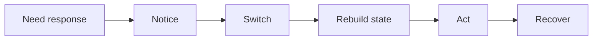
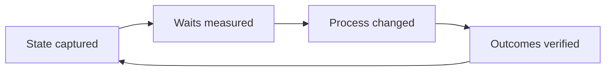

  
dev-loops

  <h1>AI Writes the Code in Seconds. Then the Work Sits for Hours.</h1>
  
Generating a change is the fast part now. The slow part is everything between actions — the wait for someone to pick the work up, rebuild the context, and decide what happens next. That waiting is invisible, unmeasured, and where your real lead time goes.

  

    wait states
    handoff cost
    coordination delay
  

---

The delay pattern

## One Interrupt Costs Five Transitions, Not Five Minutes

<ul class="tight-list">
  <li>A five-minute question doesn't cost five minutes. It costs the <strong>switch out, the rebuild, and the recovery</strong> on both sides.</li>
  <li>Every interruption walks the same five steps — <em>notice, switch, rebuild, act, recover</em> — and each one has its own latency.</li>
  <li>Across a queue of work, repeated interrupts don't add up. They <strong>multiply</strong>.</li>
</ul>

What one interrupt actually triggers

---

Handoff cost

## Every Handoff Restarts the Same Discovery From Scratch

What the receiver pays for, every time

<ul class="tight-list">
  <li>Reconstruct what changed since they last looked.</li>
  <li>Gather enough context to act with confidence.</li>
  <li>Confirm who owns it now and what's blocking it.</li>
  <li>Absorb the round-trip if any of that is unclear.</li>
</ul>

Why it's worse with mixed actors

<ul class="tight-list">
  <li>Ambiguous ownership <strong>pauses a human</strong> until they ask.</li>
  <li>Missing context <strong>halts an AI agent</strong> — it guesses or stops.</li>
  <li>Every human↔AI swap is one more place the state can drop.</li>
  <li><em>More hands speed things up only when the state crosses intact.</em></li>
</ul>

---

The blind spot

## Your Git History Hides Exactly Where the Time Went

<ul class="tight-list">
  <li>Commits record the <strong>output</strong> — they say nothing about the hours the work sat idle before someone touched it.</li>
  <li>Review threads bury the cost of re-reading and re-explaining inside ordinary back-and-forth.</li>
  <li>CI timestamps end at green. They miss the gap before a human notices and acts on the result.</li>
  <li>So the single biggest drag on lead time — <em>coordination waiting</em> — is invisible to every tool you already trust.</li>
</ul>

---

Observable state

## Four Fields Decide Whether the Next Actor Starts or Stalls

The fix isn't more meetings or more status pings. It's making the state of the work <strong>explicit</strong>, so picking it up becomes <em>continuation</em> instead of investigation.

Keep these four current and the next actor — human or agent — starts immediately, with nothing to reconstruct.

State that turns pickup into continuation

<ul class="tight-list">
  <li><strong>Who owns it now</strong> — no guessing whose move it is.</li>
  <li><strong>What's blocking it</strong> — and what would unblock it.</li>
  <li><strong>The latest decision</strong> — so nobody re-litigates settled ground.</li>
  <li><strong>The safe next step</strong> — the one move that's known to be safe.</li>
</ul>

---

The measurement loop

## You Can't Shorten a Wait You Never Measured

<ul class="tight-list">
  <li>Capture the state, and the waits between actors stop being anecdotes — they become <strong>numbers you can point at</strong>.</li>
  <li>Find the transition that stalls most, change the process there, and check whether the wait actually dropped.</li>
  <li>Then confirm the change didn't <em>trade speed for quality</em>. Faster only counts if it's still correct.</li>
</ul>

A loop you can actually run

---

From idea to instrument

## Those Four Fields Aren't a Wish — They're Where the Work Already Lives

Owner &amp; next step are a board

<ul class="mini-list">
  <li>Work moves through visible columns: waiting, in progress, done.</li>
  <li>The column <em>is</em> the current owner and the safe next step.</li>
  <li>A deterministic resolver picks the next action — no guessing whose move it is.</li>
</ul>

Decisions leave a trail

<ul class="mini-list">
  <li>Each review gate records its verdict in the open, with the findings behind it.</li>
  <li>The latest decision is written down, not held in someone's head.</li>
  <li>Pick the work up tomorrow and the reasoning is still there.</li>
</ul>

Automate only where it's safe

<ul class="mini-list">
  <li>The wait at CI is handled by waiting on the real result, on any provider.</li>
  <li>After a merge, finished workspaces are reclaimed and long-done items archived.</li>
  <li>Automation runs only where the state says continuing is safe.</li>
</ul>

---

Why it pays off

## Visible State Moves Three Numbers at Once

Quality

<ul class="mini-list">
  <li>Fewer wrong resumptions from stale context.</li>
  <li>Cleaner fix loops.</li>
  <li>Regressions are easier to trace back.</li>
</ul>

Waiting time

<ul class="mini-list">
  <li>Faster first action after a handoff.</li>
  <li>Context is already present at pickup.</li>
  <li>Approvals stop sitting unnoticed.</li>
</ul>

Throughput

<ul class="mini-list">
  <li>Higher flow efficiency.</li>
  <li>Fewer items stalled in the dark.</li>
  <li>Less coordination drag per merge.</li>
</ul>

---

The takeaway

## The Cheapest Speed-Up Is Making the Waiting Visible

<ul class="tight-list">
  <li><strong>Make the state explicit,</strong> and pickup becomes continuation instead of an investigation.</li>
  <li><strong>Measure the waits,</strong> and the biggest stall stops hiding behind your commit history.</li>
  <li><strong>Automate only where state proves it's safe,</strong> and you remove the stall without removing the judgment.</li>
</ul>

Stop optimizing how fast you write code. Start measuring how long it waits.

