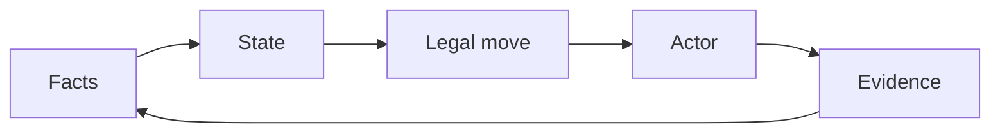
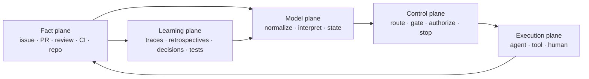
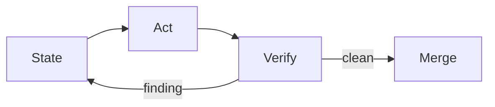
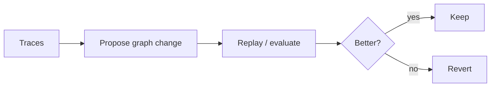

  
dev-loops

  <h1>The State Graph Is the Surface</h1>
  
The workflow does not live in an agent's memory. dev-loops models the state of the work, derives one legal next move, and lets an agent, tool, or human execute that transition.

  

    deterministic state
    bounded loops
    GitHub evidence
    human authority
  

---

Where it fits

## Three Ideas, One Control Surface

Ralph loops

<ul class="mini-list">
  <li>Persist across repeated runs.</li>
  <li>Keep context in durable artifacts.</li>
  <li>Make one bounded move per cycle.</li>
</ul>

Karpathy loops

<ul class="mini-list">
  <li>Evaluate each candidate.</li>
  <li>Keep improvements, discard regressions.</li>
  <li>Turn iteration into search.</li>
</ul>

Graph engineering

<ul class="mini-list">
  <li>Encode known paths and cycles.</li>
  <li>Mix deterministic and agentic steps.</li>
  <li>Make transitions inspectable.</li>
</ul>

<strong>dev-loops composes all three around authoritative modeled state.</strong>

---

The reframe

## Not a Graph of Agents — a Graph of Work

<ul class="tight-list">
  <li>The graph models the <strong>current state of the change</strong>.</li>
  <li>The surface projects the <strong>next actor, action, gate, wait, or stop</strong>.</li>
  <li>Agents are replaceable executors inside bounded transitions.</li>
  <li>Every action returns to authoritative facts before the next move.</li>
</ul>

The control cycle

---

Architecture

## Five Planes, One Loop

The execution context can disappear. The state model, backend evidence, and contracts remain sufficient to resume.

---

Composition

## One Public Surface, Nested State Graphs

Public graph

<ul class="mini-list">
  <li>target</li>
  <li>ownership</li>
  <li>next actor</li>
  <li>status</li>
  <li>authorization</li>
</ul>

Lifecycle graph

<ul class="mini-list">
  <li>issue intake</li>
  <li>refinement</li>
  <li>implementation</li>
  <li>draft gate</li>
  <li>feedback resolution</li>
  <li>pre-approval</li>
  <li>merge</li>
</ul>

Inner graphs

<ul class="mini-list">
  <li>Copilot review/fix</li>
  <li>reviewer fan-out/fan-in</li>
  <li>CI waits and retries</li>
  <li>UI validation</li>
  <li>specialized bounded loops</li>
</ul>

The conductor composes the machines through contracts instead of flattening them into one giant prompt.

---

Loop semantics

## A Loop Is Repeated State Resolution

<pre><code>until terminal or human stop:
  snapshot = observe()
  state = interpret(snapshot)
  route = resolve(state)
  execute_one(route)
  record()
  refresh()</code></pre>

<ul class="tight-list">
  <li><strong>One bounded move</strong>, then control returns to the resolver.</li>
  <li>The refresh catches new reviews, CI changes, head changes, steering, merges, and closures.</li>
  <li>No worker is allowed to carry stale assumptions forward as truth.</li>
  <li>Fresh sessions resume from facts, not chat memory.</li>
</ul>

---

Backend

## GitHub Is the Evidence Plane

Tracker

<ul class="mini-list">
  <li>work identity</li>
  <li>specification</li>
  <li>assignment</li>
  <li>issue ↔ PR linkage</li>
</ul>

Review + verification

<ul class="mini-list">
  <li>threads and resolutions</li>
  <li>gate verdicts</li>
  <li>CI checks</li>
  <li>head-pinned evidence</li>
</ul>

Terminal truth

<ul class="mini-list">
  <li>merged is observable</li>
  <li>closed is observable</li>
  <li>done cannot be fabricated</li>
  <li>fresh runs can recover</li>
</ul>

GitHub is the current reference tracker/review backend — not merely a place to push the final diff.

---

Division of responsibility

## Determinism Sets Boundaries; Agency Does Work

Deterministic

<ul class="mini-list">
  <li>normalize facts</li>
  <li>interpret state</li>
  <li>enforce transitions</li>
  <li>verify evidence</li>
  <li>fail closed</li>
</ul>

Agentic

<ul class="mini-list">
  <li>refine scope</li>
  <li>explore the repo</li>
  <li>implement</li>
  <li>review through a lens</li>
  <li>fix and explain</li>
</ul>

Human

<ul class="mini-list">
  <li>resolve ambiguity</li>
  <li>set policy</li>
  <li>accept risk</li>
  <li>authorize merge by default</li>
  <li>remain accountable</li>
</ul>

---

Applicability

## Same Control Model: Greenfield and Brownfield

Greenfield

<ul class="tight-list">
  <li>Start from a plan or new tracker item.</li>
  <li>Establish architecture during refinement.</li>
  <li>Create tests and implementation together.</li>
</ul>

Brownfield

<ul class="tight-list">
  <li>Compile existing architecture, behavior, and history into the evidence bundle.</li>
  <li>Protect compatibility, migrations, data, and rollout.</li>
  <li>Use stronger regression and contract gates.</li>
</ul>

<strong>Codebase age changes the context and evidence — not the state-backed control model.</strong>

---

Learning

## Two Loops Improve Different Things

Operational loop — today

Converges the current change through review, fix, retry, wait, and fail-closed recovery.

Meta-loop — natural next layer

Optimizes routing, prompts, models, context, gates, and topology against held-out real tasks.

---

Takeaway

## The State Graph Is the Product

<ul class="tight-list">
  <li><strong>GitHub</strong> preserves durable work and evidence.</li>
  <li><strong>State machines</strong> define legal progression and recovery.</li>
  <li><strong>The surface</strong> projects status, next action, steering, waits, and approvals.</li>
  <li><strong>Loops</strong> repeatedly traverse the graph.</li>
  <li><strong>Agents, tools, and humans</strong> execute bounded transitions.</li>
</ul>

Ralph contributes persistence. Karpathy contributes measured selection. Graph engineering contributes explicit control.

<strong>dev-loops brings them together around modeled state.</strong>

