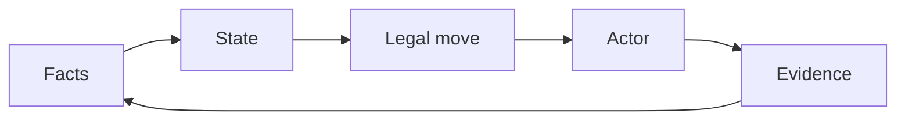
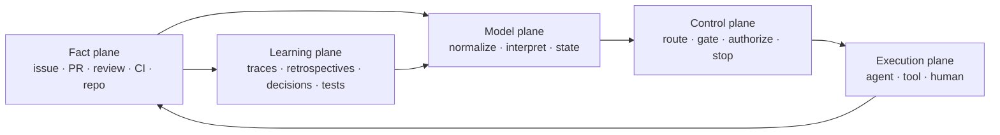
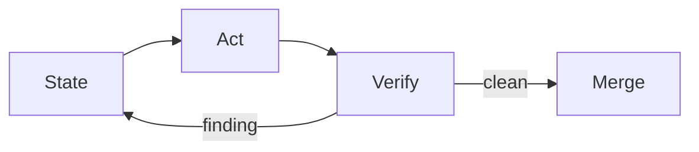
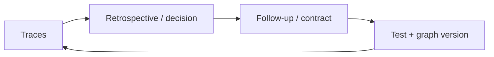

  
dev-loops

  <h1>The State Graph Is the Surface</h1>
  
The workflow does not live in an agent's memory. dev-loops models the state of the work, derives one legal next move, and lets an agent, tool, or human execute that transition.

  

    deterministic state
    bounded loops
    tracker + review evidence
    human authority
  

---

Where it fits

## Three Ideas, One Control Surface

Ralph loops

<ul class="mini-list">
  <li>Persist across repeated runs.</li>
  <li>Keep state in durable artifacts.</li>
  <li>Make one bounded move per cycle.</li>
</ul>

Karpathy loops

<ul class="mini-list">
  <li>Evaluate every candidate.</li>
  <li>Keep improvements; revert regressions.</li>
  <li>Turn iteration into measurable search.</li>
</ul>

Graph engineering

<ul class="mini-list">
  <li>Encode paths, branches, waits, and cycles.</li>
  <li>Mix deterministic and agentic nodes.</li>
  <li>Make control flow inspectable.</li>
</ul>

<strong>dev-loops composes all three around authoritative modeled state.</strong>

---

The reframe

## Not a Graph of Agents — a Graph of Work

<ul class="tight-list">
  <li>The graph models the <strong>current state of the change</strong>.</li>
  <li>The surface projects the <strong>next actor, action, gate, wait, stop, or reconcile path</strong>.</li>
  <li>Agents are replaceable executors inside bounded transitions.</li>
  <li>Every action returns to authoritative facts before the next move.</li>
</ul>

The control cycle

---

Architecture

## Five Planes, One Repeating Traversal

The execution context can disappear. Backend evidence, state models, and contracts remain sufficient to reconstruct the next move.

---

The public surface

## The Surface Is Compiled from Modeled State

Canonical state dimensions

<ul class="tight-list">
  <li><strong>target</strong> — which artifact is active?</li>
  <li><strong>ownership</strong> — which durable owner or strategy family is responsible?</li>
  <li><strong>nextActor</strong> — who must act now?</li>
  <li><strong>status</strong> — active, waiting, blocked, approval-ready, merge-ready, done?</li>
  <li><strong>authorization</strong> — permitted, needs confirmation, or forbidden?</li>
</ul>

Projected control surface

<ul class="tight-list">
  <li>route kind and internal strategy</li>
  <li>next action and selected gate</li>
  <li>wait and timeout semantics</li>
  <li>stop or reconcile reason</li>
  <li>handoff envelope and required evidence</li>
</ul>

Start, continue, inspect, steer, wait, approve, and merge are views and transitions over the same model — not parallel workflows.

---

Composition

## One Public Surface, Nested State Graphs

Public graph

<ul class="mini-list">
  <li>artifact + ownership</li>
  <li>status + authorization</li>
  <li>execution mode</li>
  <li>operator-visible next action</li>
</ul>

Lifecycle graph

<ul class="mini-list">
  <li>issue intake</li>
  <li>refinement</li>
  <li>implementation</li>
  <li>draft gate</li>
  <li>feedback resolution</li>
  <li>pre-approval + merge</li>
</ul>

Inner graphs

<ul class="mini-list">
  <li>Copilot review/fix</li>
  <li>reviewer fan-out/fan-in</li>
  <li>CI waits and retries</li>
  <li>UI validation</li>
  <li>specialized bounded loops</li>
</ul>

The conductor composes state machines through contracts instead of flattening them into one giant prompt.

---

Loop semantics

## A Loop Is Repeated State Resolution

<pre><code>until terminal or human stop:
  snapshot = observe()
  state = interpret(snapshot)
  route = resolve(state)
  execute_one(route)
  record()
  refresh()</code></pre>

<ul class="tight-list">
  <li><strong>One bounded move</strong>, then control returns to the resolver.</li>
  <li>The refresh catches new reviews, CI changes, head changes, steering, merges, and closures.</li>
  <li>No worker carries stale assumptions forward as truth.</li>
  <li>Fresh sessions resume from facts, not conversational memory.</li>
</ul>

---

Backend

## GitHub Is the Current Evidence Plane

Tracker + identity

<ul class="mini-list">
  <li>work identity and spec</li>
  <li>assignment and queue</li>
  <li>issue ↔ PR linkage</li>
  <li>provider seam for issues/board</li>
</ul>

Review + verification

<ul class="mini-list">
  <li>reviews and threads</li>
  <li>gate verdicts</li>
  <li>CI checks</li>
  <li>head-pinned evidence</li>
</ul>

Terminal truth + recovery

<ul class="mini-list">
  <li>merged and closed are observable</li>
  <li>done cannot be fabricated</li>
  <li>fresh runs can reconstruct state</li>
  <li>durable comments preserve decisions</li>
</ul>

The tracker seam is provider-pluggable for issues and boards. The PR, review, CI, and Copilot surface remains GitHub-coupled in v1.

---

Division of responsibility

## Determinism Sets Boundaries; Agency Does Work

Deterministic

<ul class="mini-list">
  <li>normalize facts</li>
  <li>interpret state</li>
  <li>enforce transitions</li>
  <li>verify current-head evidence</li>
  <li>fail closed</li>
</ul>

Agentic

<ul class="mini-list">
  <li>refine scope</li>
  <li>explore the repository</li>
  <li>implement</li>
  <li>review through a lens</li>
  <li>diagnose, fix, explain</li>
</ul>

Human

<ul class="mini-list">
  <li>resolve ambiguity</li>
  <li>set policy</li>
  <li>accept high-risk trade-offs</li>
  <li>authorize merge by default</li>
  <li>remain accountable</li>
</ul>

---

Applicability

## Same Control Model: Greenfield and Brownfield

Greenfield

<ul class="tight-list">
  <li>Start from a local plan or new tracker item.</li>
  <li>Establish architecture during refinement.</li>
  <li>Create tests and implementation together.</li>
</ul>

Brownfield

<ul class="tight-list">
  <li>Compile existing architecture, behavior, and history into the evidence bundle.</li>
  <li>Protect compatibility, migrations, data, and rollout.</li>
  <li>Use stronger regression and contract gates.</li>
</ul>

<strong>The toolset has already been used successfully in both contexts.</strong> Codebase age changes context and verification burden — not the state-backed control model.

The deferred Phase 7 second-repo pilot is a formal, reproducible portability proof; it is separate from operational evidence across greenfield and brownfield work.

---

Learning

## Two Loops Improve Different Things

Operational loop — current change

Converges the current change through review, fix, retry, wait, and fail-closed recovery.

Learning loop — future changes

Turns outcomes into stronger contracts, tests, review lenses, and routing policy.

---

Next layer

## A Karpathy-Style Meta-Loop over the Surface

<ul class="tight-list">
  <li>Propose a change to routing, prompts, models, context, gates, or topology.</li>
  <li>Replay current and candidate graph versions on held-out real tasks.</li>
  <li>Measure correctness, review burden, latency, cost, and policy violations.</li>
  <li>Keep the candidate only when it improves inside fixed safety constraints.</li>
</ul>

Why dev-loops is a strong substrate

<ul class="tight-list">
  <li>The optimization target is versioned and inspectable.</li>
  <li>States, transitions, gates, and traces are already testable.</li>
  <li>The evaluator can remain outside the candidate's control.</li>
  <li>Every accepted graph change can pass through the same PR evidence pipeline.</li>
</ul>

---

Takeaway

## The State Graph Is the Product

<ul class="tight-list">
  <li><strong>The backend</strong> preserves durable work and evidence.</li>
  <li><strong>State machines</strong> define legal progression and recovery.</li>
  <li><strong>The surface</strong> projects status, next action, steering, waits, and approvals.</li>
  <li><strong>Loops</strong> repeatedly traverse the graph.</li>
  <li><strong>Agents, tools, and humans</strong> execute bounded transitions.</li>
</ul>

Ralph contributes persistence. Karpathy contributes measured selection. Graph engineering contributes explicit control.

<strong>dev-loops brings them together around modeled state.</strong>

The agent may change. The harness may change. The state graph stays authoritative, and every loop comes back to it.

---

References

## Sources and Repository Contracts

External framing

<ul class="tight-list">
  <li><a href="https://ghuntley.com/ralph/">Geoffrey Huntley — Ralph</a></li>
  <li><a href="https://github.com/karpathy/autoresearch">Andrej Karpathy — AutoResearch</a></li>
  <li><a href="https://www.langchain.com/blog/3-years-of-graph-engineering-with-langgraph">LangChain — Three Years of Graph Engineering</a></li>
</ul>

dev-loops contracts

<ul class="tight-list">
  <li><code>packages/core/src/loop/lifecycle-state.mjs</code></li>
  <li><code>skills/docs/public-dev-loop-contract.md</code></li>
  <li><code>skills/docs/pr-lifecycle-contract.md</code></li>
  <li><code>skills/docs/conductor-routing-contract.md</code></li>
  <li><code>skills/docs/tracker-seam-contract.md</code></li>
</ul>

